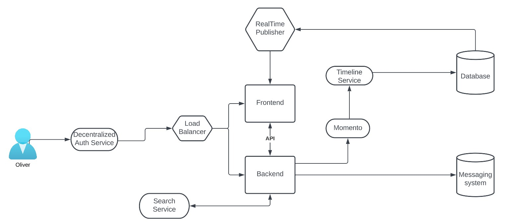
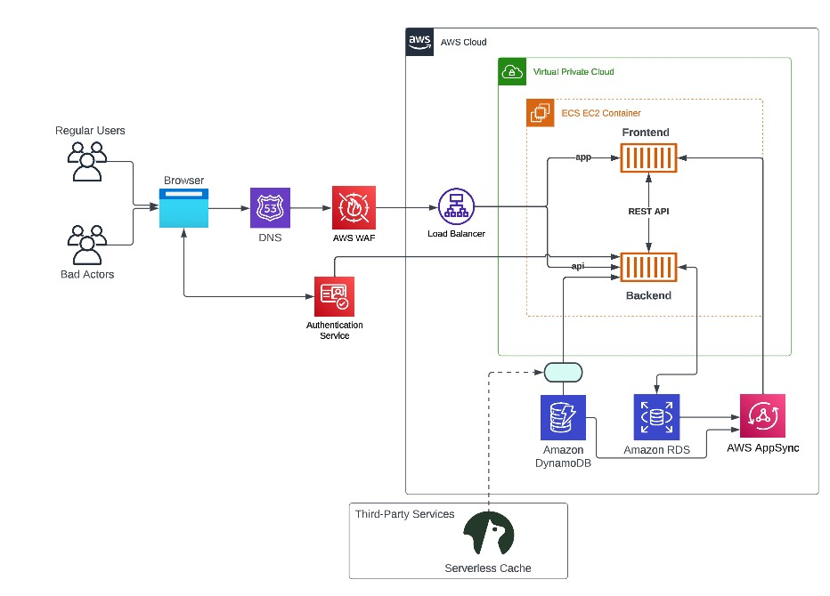

# Week 0 — Billing and Architecture
## Homework
- Destroy your root account credentials, Set MFA, IAM role
- Use EventBridge to hookup Health Dashboard to SNS and send notification when there is a service health issue.
- Review all the questions of each pillars in the Well Architected Tool (No specialized lens)
- Create an architectural diagram (to the best of your ability) the CI/CD logical pipeline in Lucid Charts
- Research the technical and service limits of specific services and how they could impact the technical path for technical flexibility. 
- Open a support ticket and request a service limit

# Architectural Diagram
## Conceptual Diagram

## Logical Architectural Diagram

