# Week 0 — Billing and Architecture
## Homework
- ~~Destroy your root account credentials, Set MFA, IAM role~~
- Use EventBridge to hookup Health Dashboard to SNS and send notification when there is a service health issue.
- Review all the questions of each pillars in the Well Architected Tool (No specialized lens)
- ~~Create an architectural diagram (to the best of your ability) the CI/CD logical pipeline in Lucid Charts~~
- Research the technical and service limits of specific services and how they could impact the technical path for technical flexibility. 
- Open a support ticket and request a service limit

# AWS Well-Architected Framework
<a href="https://docs.aws.amazon.com/wellarchitected/latest/framework/welcome.html">AWS Well-Architected Framework</a>

## Operational Excellence Pillar

## Security Pillar

## Reliability Pillar

## Performance Efficiency Pillar

## Cost Optimization Pillar

## Sustainability Pillar

# Architectural Diagram
## Conceptual Diagram

## Logical Architectural Diagram

# Create an admin user with MFA & IAM Roles
## Create admin user + admin user group
Once logged into the AWS console, search IAM to locate the service and click to manage access to AWS resources. (https://console.aws.amazon.com/iam/)

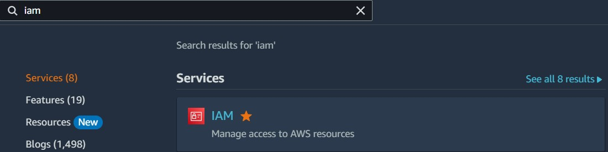

From this page, you will see the IAM dashboard which informs you if the Root user has MFA enabled, if any access keys are active, and if you need to update access permissions for AWS Billing, Cost Management, and Account consoles.

You will also be able to manage users, groups, and roles from the IAM dashboard.

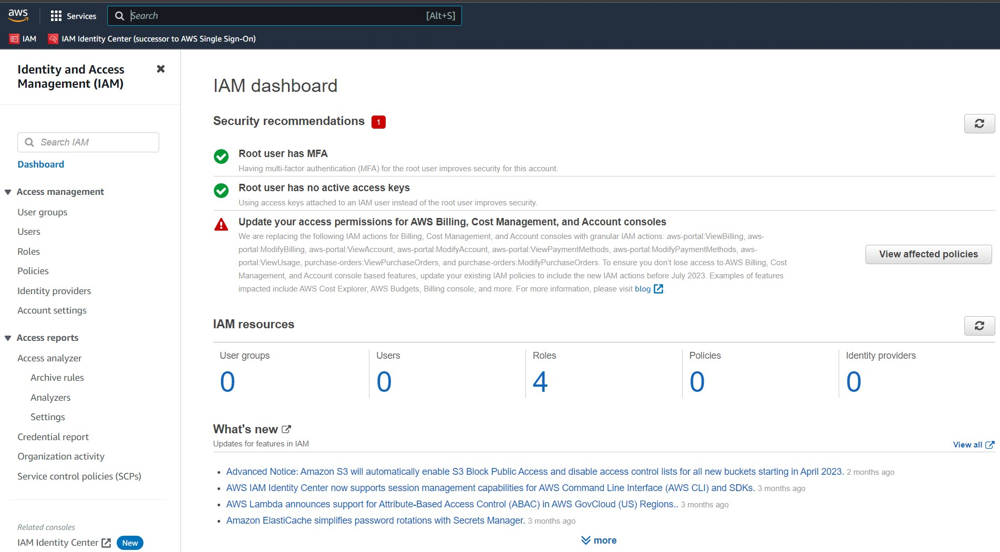

On the left-hand side, click Users > Add Users to add a new user.

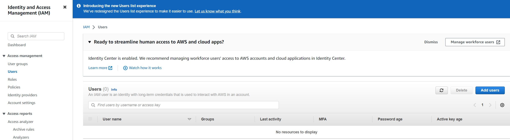

From the next page, we will enter a username, select the Enable console access checkbox (to allow the user to sign in to the AWS Mangement Console), and generate a password before clicking Next to move on to configuring user permissions.

We want to create this new user with Admin permissions so we will need to make a new User Group (IAM) with the permissions.

Click Create group. 
- Create a User group name; ex: Administrators.
- Select AdministratorAccess (should be the first option in the Permission policies list).
- Scroll to the bottom of the list and click Create user group.
- Click Next.

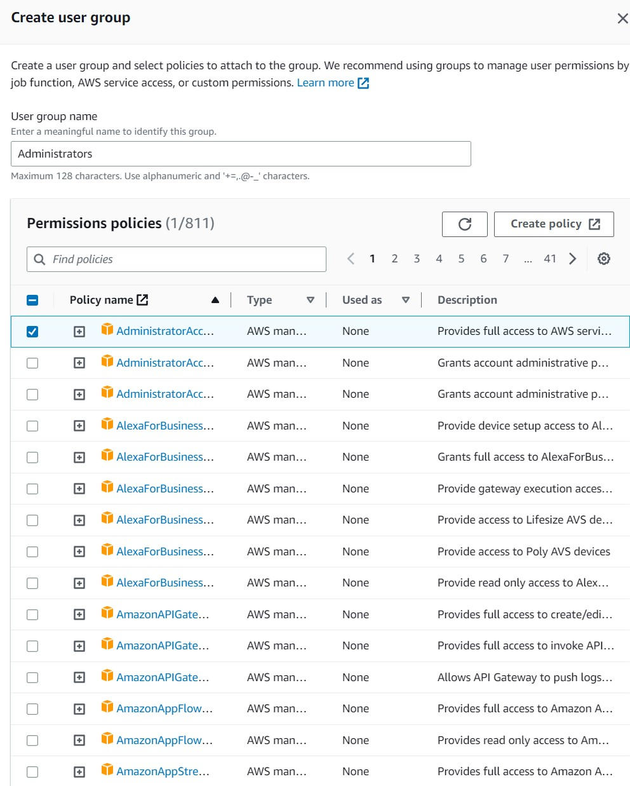

Review the user details to confirm the details are correct, then click Create user.

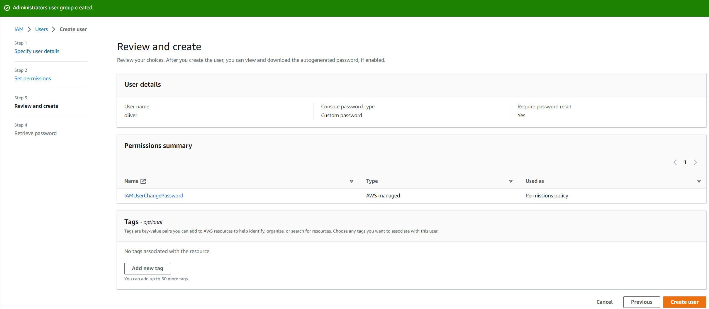

On the next page, you can view & download the user's password or email the users instructions for signing in to the AWS Management Console. 

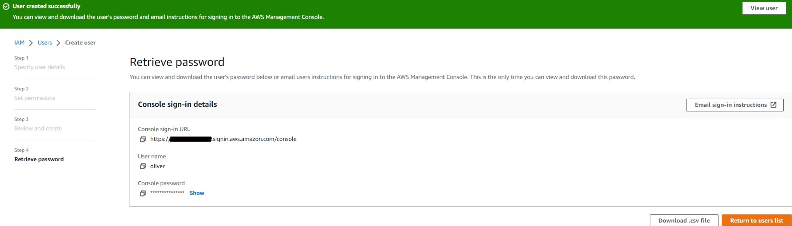

NOTE: You may need to add the user to the new User group you created before the user will be assigned the appropriate permissions. I ran into an issue after signing into the newly created admin account where I saw an error "You don't have permissions" when attempting to setup MFA. When I viewed the user group "Administrators" my user was not assigned for some reason. Assigning the user account to the group resolved the issue.

## Sign into admin user account to enable MFA & access keys
<a href="https://signin.aws.amazon.com/signin?redirect_uri=https%3A%2F%2Fus-east-2.console.aws.amazon.com%2Fconsole%2Fhome%3FhashArgs%3D%2523%26isauthcode%3Dtrue%26region%3Dus-east-2%26state%3DhashArgsFromTB_us-east-2_50d727ee5bfe22a4&client_id=arn%3Aaws%3Asignin%3A%3A%3Aconsole%2Fcanvas&forceMobileApp=0&code_challenge=XMwIMrRc4e00A59znlo2b66caHJ6TlAn0XmWTrPrYGI&code_challenge_method=SHA-256">AWS Signin Page</a>

Select IAM user

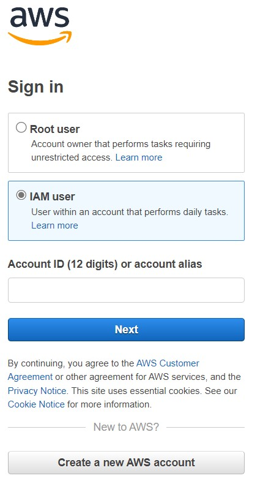

- Enter the 12 digit Account ID
- Click Next

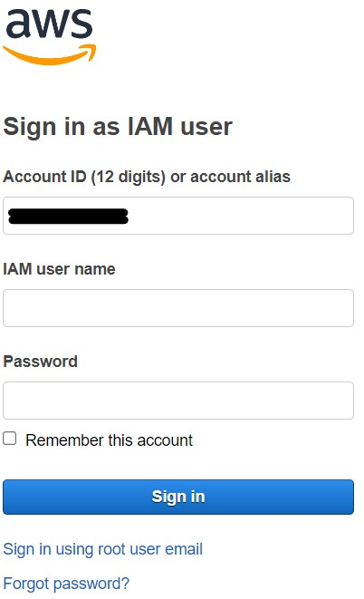

- Enter the username & password.
- Click Sign in
- Enter in current/old password
- Enter in a new password
- Confirm new password
- Click Confirm password change

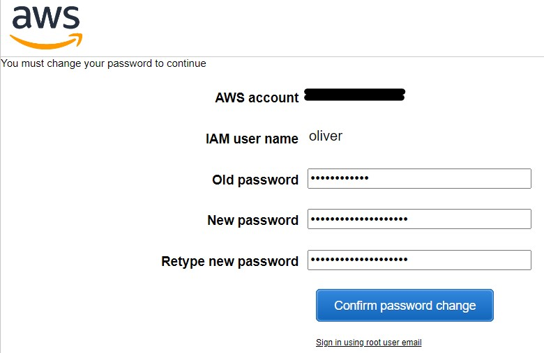

Once we have signed in, we will setup MFA by navigating to Security Credentials. You can access this by clicking on your username in the upper-right hand corner, then clicking on Security credentials.

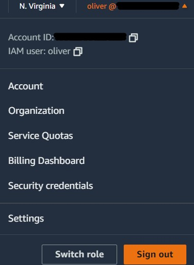

From the next page "My security credentials", click Assign MFA. 

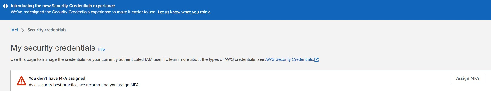

Specify the MFA device name, then choose an MFA device before clicking Next.

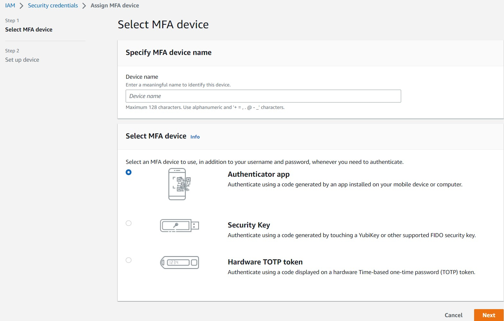

On the Set up device page, you will set up your authenticator app. 
- Install a compatible app like Google Authenticator, Duo Mobile, or Authy on your phone or computer. 
- Click on Show QR code; open your authenticator app then scan the code
- Fill in 2 consecutive codes from the MFA device
- Click Add MFA

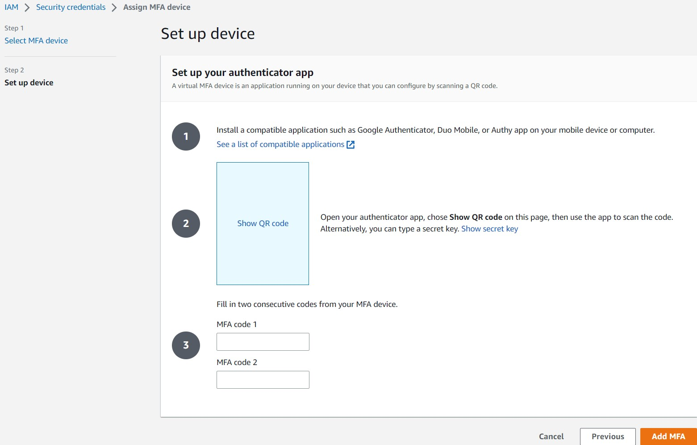

On the next page you will see the banner below confirming the MFA device was successfully assigned! 

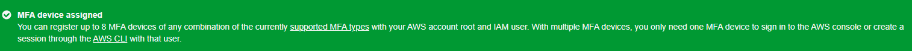

## Create Access Keys
From IAM, select the user then select Security Credentials.

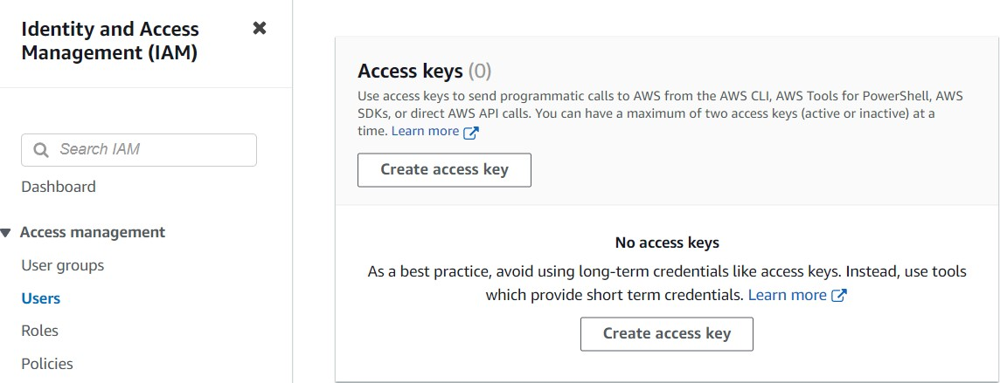

- Click Create access key.
- Choose one of the options (We're setting up Access keys for the CLI) 

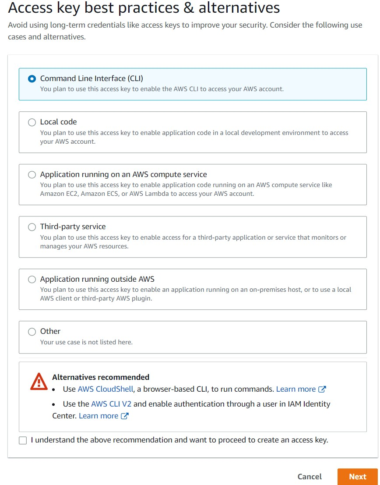

- Check the box to state you understand the above recommendation and want to proceed to create an access key.
- Click Next
- Set a description tag (optional)
- Click Create access key
- Retrieve your access key on the next page.

Optional: download your access key in a .csv file to import the file into the CLI. 
- We're using GitPod so we cannot use this option.

Best practices:
- Never store your access keys in plain text, in a code repository, or in code.
- Disable or delete access keys when no longer needed.
- Enable least-privilege permissions.
- Rotate access keys regularly.

# Install the AWS CLI
- We are going to install the AWS CLI when our Gitpod environment launches.
- We are going to set AWS CLI to use partial autoprompt mode to make it easier to debug CLI commands.
- The bash commands we are using are the same as the <a href="https://docs.aws.amazon.com/cli/latest/userguide/getting-started-install.html" >AWS CLI Installation Instructions</a>

Update our .gitpod.yml to include the following tasks:

    tasks:
    name: aws-cli
    env:
      AWS_CLI_AUTO_PROMPT: on-partial
    init: |
      cd /workspace
      curl "https://awscli.amazonaws.com/awscli-exe-linux-x86_64.zip" -o "awscliv2.zip"
      unzip awscliv2.zip
      sudo ./aws/install
      cd $THEIA_WORKSPACE_ROOT

We'll also run these commands individually to perform the install manually.

### Set Env Vars
We will set these credentials for the current bash terminal

    export AWS_ACCESS_KEY_ID=""
    export AWS_SECRET_ACCESS_KEY=""
    export AWS_DEFAULT_REGION=us-east-1

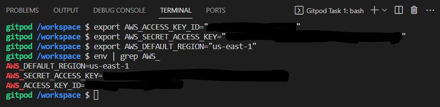

We'll tell Gitpod to remember these credentials if we relaunch our workspaces

    gp env AWS_ACCESS_KEY_ID=""
    gp env AWS_SECRET_ACCESS_KEY=""
    gp env AWS_DEFAULT_REGION=us-east-1

Check that the AWS CLI is working and you are the expected user
    
    aws sts get-caller-identity

# Create a Zero Spend Budget

After logging into the AWS Management Console, search for Budgets and create a budget. There are 2 main setup options available: Use a template and Customized. 

There are a few templates to choose from as well.

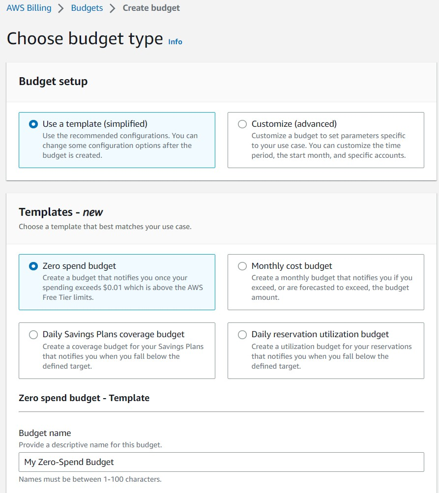

I'm choosing to setup a Zero spend budget called Zero Spend AWS Bootcamp Budget.

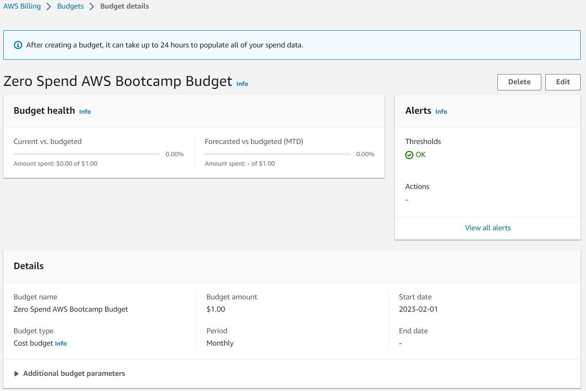

I deleted this budget and recreated it using budget.json in gitpod.

    aws budgets create-budget \
        --account-id $ACCOUNT_ID\
        --budget file://aws/json/budget.json \
        --notifications-with-subscribers file://aws/json/budget-notifications-with-subscribers.json

# Enable Billing
We need to turn on Billing Alerts to recieve alerts...

- In your Root Account go to the <a href="https://console.aws.amazon.com/billing/">Billing Page</a>
- Under Billing Preferences Choose Receive Billing Alerts
- Save Preferences 

# Creating a Billing Alarm
## Create SNS Topic
- We need an SNS topic before we create an alarm.
- The SNS topic is what will delivery us an alert when we get overbilled
- <a href="https://docs.aws.amazon.com/cli/latest/reference/sns/create-topic.html">aws sns create-topic</a>

We'll create a SNS Topic

    aws sns create-topic --name billing-alarm

which will return a TopicARN

We'll create a subscription supply the TopicARN and our Email

    aws sns subscribe \
        --topic-arn TopicARN \
        --protocol email \
        --notification-endpoint your@email.com

Check your email and confirm the subscription

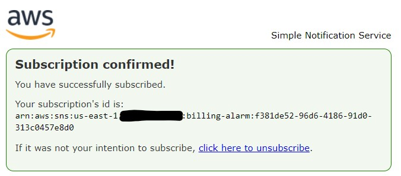

## Create Alarm
- <a href="https://docs.aws.amazon.com/cli/latest/reference/cloudwatch/put-metric-alarm.html">aws cloudwatch put-metric-alarm</a>
- <a href="https://aws.amazon.com/premiumsupport/knowledge-center/cloudwatch-estimatedcharges-alarm/">Create an Alarm via AWS CLI</a>
- We need to update the configuration json script with the TopicARN we generated earlier
- We are just a json file because --metrics is is required for expressions and so its easier to us a JSON file.

    aws cloudwatch put-metric-alarm --cli-input-json file://aws/json/alarm-config.json

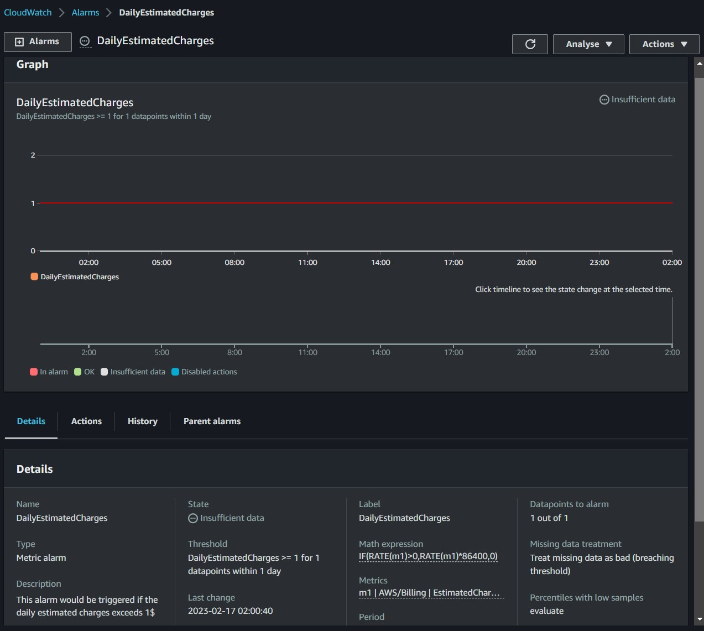

# Cloud Security
Watch <a href="https://youtu.be/4EMWBYVggQI">Ashish's Week 0 - Security Considerations video</a>
## What is Cloud Security?
Cybersecurity protects data, apps, and services associated with cloud environments from BOTH internal and external threats.

## Why should we care about Cloud Security?
- Reduces the impact of breach.
- Protects networks, apps, and services in cloud environments against malicious data theft.
- Reduces the human error that is responsible for data leaks.

## Why Cloud Security requires practice?
- Complexity.
- Always chasing our tail with new services announced throughout the year.
- Bad actors are always improving. 

## Why enable MFA for Root Account?
Root User is the most powerful user in your AWS environment with access to create new users.

In case of compromise, this account is the same as Domain Admin in the Cloud world.
- If a bad actor gains access to this account, they can create new users, services, etc. 
- ALWAYS enabled MFA on the Root User account.

## AWS Organizations
Helps manage security policies, cost policies, and billing in one central management account. The Root User is the management account. This account should not have any apps, it should only be used to create the org, the org unit, and all accounts within.

- How many types of Organizational Units (OU)
- Management Account
- Automate Vending Accounts w/Designated Owner for each AWS Account

## AWS CloudTrail

## AWS IAM User & Role Explained

## AWS Organization SCP Explained

## AWS SCP Best Practices

## AWS Best Practices