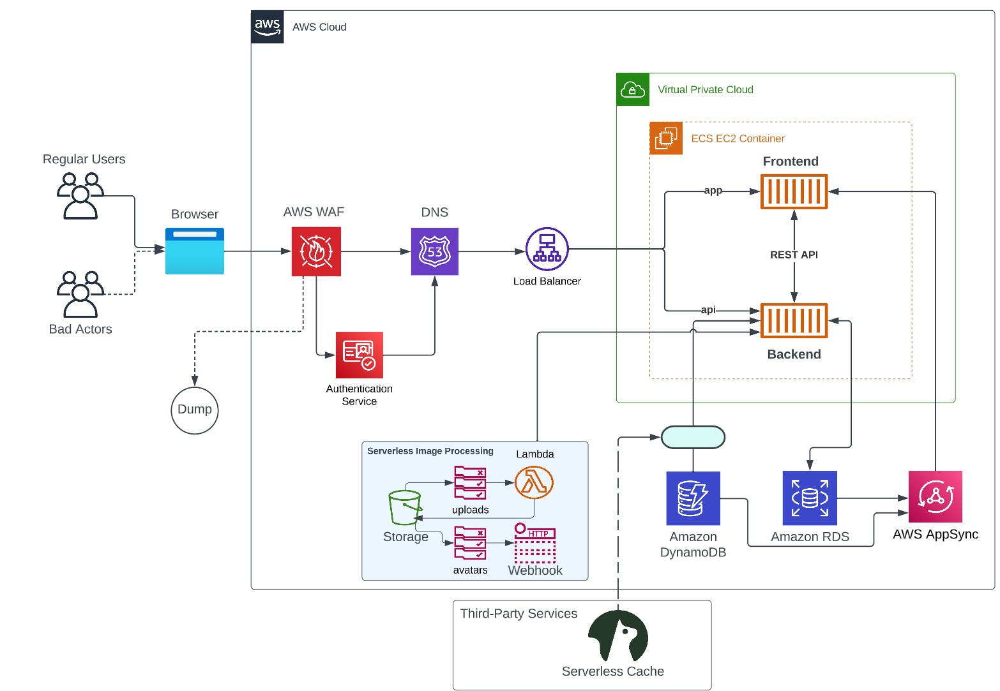

# Week 0 — Billing and Architecture
## Homework
- Destroy your root account credentials, Set MFA, IAM role
- Use EventBridge to hookup Health Dashboard to SNS and send notification when there is a service health issue.
- Review all the questions of each pillars in the Well Architected Tool (No specialized lens)
- Create an architectural diagram (to the best of your ability) the CI/CD logical pipeline in Lucid Charts
- Research the technical and service limits of specific services and how they could impact the technical path for technical flexibility. 
- Open a support ticket and request a service limit

# Architectural Diagram
## Conceptual Diagram

## Logical Architectural Diagram

# Create an admin user with MFA & IAM Roles
Once logged into the AWS console, search IAM to locate the service and click to manage access to AWS resources. (https://console.aws.amazon.com/iam/)

From this page, you will see the IAM dashboard which informs you if the Root user has MFA enabled, if any access keys are active, and if you need to update access permissions for AWS Billing, Cost Management, and Account consoles.

You will also be able to manage users, groups, and roles from the IAM dashboard.

On the left-hand side, click Users > Add Users to add a new user.

From the next page, we will enter a username, select the Enable console access checkbox (to allow the user to sign in to the AWS Mangement Console), and generate a password before clicking Next to move on to configuring user permissions.

We want to create this new user with Admin permissions so we will need to make a new User Group (IAM) with the permissions.

Click Create group. 
- Create a User group name; ex: Administrators.
- Select AdministratorAccess (should be the first option in the Permission policies list).
- Scroll to the bottom of the list and click Create user group.
- Click Next.

Review the user details to confirm the details are correct, then click Create user.

On the next page, you can view & download the user's password or email the users instructions for signing in to the AWS Management Console. 

