# Week 0 — Billing and Architecture
## Required Homework
- [x] Watched Week 0 - <a href="https://www.youtube.com/watch?v=SG8blanhAOg&list=PLBfufR7vyJJ7k25byhRXJldB5AiwgNnWv&index=12">Live Streamed Video</a>
- [x] Watched Chirag's Week 0 - <a href="https://www.youtube.com/watch?v=OVw3RrlP-sI&list=PLBfufR7vyJJ7k25byhRXJldB5AiwgNnWv&index=13">Spend Considerations</a>
- [x] Watched Ashish's Week 0 - <a href="https://www.youtube.com/watch?v=4EMWBYVggQI&list=PLBfufR7vyJJ7k25byhRXJldB5AiwgNnWv&index=15">Security Considerations</a>
- [x] Recreate Conceptual Diagram in Lucid Charts or on a Napkin
- [x] Recreate Logical Architectural Diagram in Lucid Charts
- [x] Create Admin User
- [x] Use CloudShell
- [x] Generate AWS Credentials
- [x] Install AWS CLI
- [x] Create a Billing Alarm
- [x] Create a Budget

## Homework Challenges
- [x] Destroy your root account credentials, Set MFA, IAM role.
- [x] Use EventBridge to hookup Health Dashboard to SNS and send notification when there is a service health issue.
- [x] Review all the questions of each pillars in the Well Architected Tool (No specialized lens)
- [x] Create an architectural diagram (to the best of your ability) the CI/CD logical pipeline in Lucid Charts.
- [ ] Research the technical and service limits of specific services and how they could impact the technical path for technical flexibility. 
- [ ] Open a support ticket and request a service limit

# AWS Well-Architected Framework
<a href="https://docs.aws.amazon.com/wellarchitected/latest/framework/welcome.html">AWS Well-Architected Framework</a>

## Operational Excellence Pillar
### Design Principles
There are 5 design principles for operational excellence in the cloud:
- Perform operations as code
- Make frequent, small, reversible changes
- Refine operations procedures frequently
- Anticipate failure
- Learn from all operational failures

There are 4 best practice areas for operational excellence in the cloud:
- Organization
    - OPS 1: How do you determine what your priorities are?
    - OPS 2: How do you strcture your organization to support your business outcomes?
    - OPS 3: How does your organizational culture support your business outcomes?

- Prepare
    - OPS 4: How do you design your workload so that you can understand its state?
    - OPS 5: How do you reduce defects, ease remediation, and improve flow into production?
    - OPS 6: How do you mitigate deployment risks?
    - OPS 7: How do you know that you are ready to support a workload?

- Operate
    - OPS 8: How do you understand the health of your workload?
    - OPS 9: How do you understand the health of your operations?
    - OPS 10: How do you manage workload and operations events?

- Evolve
    - OPS 11: How do you evolve operations?

## Security Pillar
### Design Principles
There are 7 design principles for security in the cloud:
- Implement a strong identity foundation
- Enable traceability
- Apply security at all layers
- Automate security best practices
- Protect data in transit and at rest
- Keep people away from data
- Prepare for security events

There are 6 best practice areas for operational excellence in the cloud:
- Security
    - SEC 1: How do you securely operate your workload?

- Identity and Access Management
    - SEC 2: How do you manage identities for people and machines?
    - SEC 3: How do you manage permissions for people and machines?

- Detection
    - SEC 4: How do you detect and investigate security events?

- Infrastructure Protection
    - SEC 5: How do you protect your network resources?
    - SEC 6: How do you protect your compute resources?

- Data Protection
    - SEC 7: How do you classify your data?
    - SEC 8: How do you protect your data at rest?
    - SEC 9: How do you protect your data in transit?

- Incident Response
    - SEC 10: How do you anticipate, respond to, and recover from incidents?

## Reliability Pillar
There are 5 design principles for reliability in the cloud:
- Automatically recover from failure
- Test recovery procedures
- Scale horizontally to increase aggregate workload availability
- Stop guessing capacity
- Manage change in automation

There are 4 best practice areas for reliability in the cloud:
- Foundations
    - REL 1: How do you manage service quotas and constraints?
    - REL 2: How do you plan your network topology?

- Workload Architecture
    - REL 3: How do you design your workload service architecture?
    - REL 4: How do you design interactions in a distributed system to prevent failures?
    - REL 5: How do you design interactions in a distributed system to mitigate or withstand failures?

- Change Management
    - REL 6: How do you monitor workload resources?
    - REL 7: How do you design your workload to adapt to changes in demand?
    - REL 8: How do you implement change?

- Failure Management
    - REL 9: How do you back up data?
    - REL 10: How do you use fault isolation to protect your workload?
    - REL 11: How do you design your workload to withstand component failures?
    - REL 12: How do you test reliability?
    - REL 13: How do you plan for disaster recovery (DR)?

## Performance Efficiency Pillar
There are 5 design priniciples for performance efficiency in the cloud:
- Democratize advanced technologies
- Go global in minutes
- Use serverless architectures
- Experiment more often
- Consider mechanical sympathy

There are 4 best practice areas for performance efficiency in the cloud:
- Selection
    - PERF 1: How do you select the best performing architecture?

        - Compute
            - PERF 2: How do you select your compute solution?

        - Storage
            - PERF 3: How do you select your storage solution?

        - Database
            - PERF 4: How do you select your database solution?

        - Network
            - PERF 5: How do you configure your networking solution?
- Review
    - PERF 6: How do you evolve your workload to take advantage of new releases?

- Monitoring
    - PERF 7: How do you monitor your resources to ensure they are performing?

- Tradeoffs
    - PERF 8: How do you use tradeoffs to improve performance?

## Cost Optimization Pillar
There are 5 design priniciples for cost optimization in the cloud:
- Implement Cloud Financial Management
- Adopt a consumption model
- Measure overall efficiency
- Stop spending money on undifferentiated heavy lifting
- Analyze and attribute expenditure

There are 5 best practice areas for cost optimization in the cloud:
- Practice Cloud Financial Management
    - COST 1: How do you implement cloud financial management?

- Expenditure and usage awareness
    - COST 2: How do you govern usage?
    - COST 3: How do you monitor usage and cost?
    - COST 4: How do you decommission resources?

- Cost-effective resources
    - COST 5: How do you evaluate cost when you select services?
    - COST 6: How do you meet cost targets when you select resource type, size and number?
    - COST 7: How do you use pricing models to reduce cost?
    - COST 8: How do you plan for data transfer charges?

- Manage demand and supply resources
    - COST 9: How do you manage demand, and supply resources?

- Optimize over time
    - COST 10: How do you evaluate new services?

## Sustainability Pillar
There are 6 design principles for sustainability in the cloud:
- Understand your impact
- Establish sustainability goals
- Maximize utilization
- Anticipate and adopt new, more efficient hardware and software offerings
- Use managed services
- Reduce the downstream impact of your cloud workloads

There are 6 best practice areas for sustainability in the cloud:
- Region selection
    - SUS 1: How do you select Regions to support your sustainability goals?

- User behavior patterns
    - SUS 2: How do you take advantage of user behavior patterns to support your sustainability goals?

- Software and architecture patterns
    - SUS 3: How do you take advantage of software and architecture patterns to support your sustainability goals?

- Data patterns
    - SUS 4: How do you take advantage of data access and usage patterns to support your sustainability goals?

- Hardware patterns
    - SUS 5: How do your hardware management and usage practices support your sustainability goals?

- Development and deployment process
    - SUS 6: How do your development and deployment processes support your sustainability goals?

# Architectural Diagram
## Conceptual Diagram
<a href="https://lucid.app/lucidchart/f7113fc8-7465-4a18-8463-ec1e6089e5d9/edit?viewport_loc=-551%2C-134%2C2389%2C1175%2C0_0&invitationId=inv_5bb1febf-8f1a-4404-aeaf-1f41c1d38d30">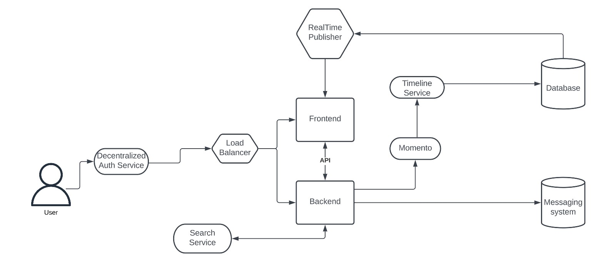</a>

## Logical Architectural Diagram
Still working on this as I want to add extra security measures to the CI/CD pipeline to prevent bad actors from accessing the app. 

Update: Removed AWS Firewall due to Spend considerations.

# Create an admin user with MFA & IAM Roles
## Create admin user + admin user group
Once logged into the AWS console, search IAM to locate the service and click to manage access to AWS resources. (https://console.aws.amazon.com/iam/)

From this page, you will see the IAM dashboard which informs you if the Root user has MFA enabled, if any access keys are active, and if you need to update access permissions for AWS Billing, Cost Management, and Account consoles.

You will also be able to manage users, groups, and roles from the IAM dashboard.

On the left-hand side, click Users > Add Users to add a new user.

From the next page, we will enter a username, select the Enable console access checkbox (to allow the user to sign in to the AWS Mangement Console), and generate a password before clicking Next to move on to configuring user permissions.

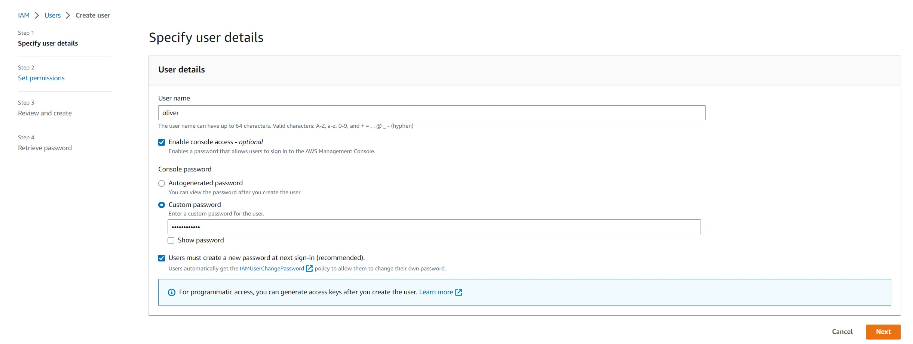

We want to create this new user with Admin permissions so we will need to make a new User Group (IAM) with the permissions.

Click Create group. 
- Create a User group name; ex: Administrators.
- Select AdministratorAccess (should be the first option in the Permission policies list).
- Scroll to the bottom of the list and click Create user group.
- Click Next.

Review the user details to confirm the details are correct, then click Create user.

On the next page, you can view & download the user's password or email the users instructions for signing in to the AWS Management Console. 

NOTE: You may need to add the user to the new User group you created before the user will be assigned the appropriate permissions. I ran into an issue after signing into the newly created admin account where I saw an error "You don't have permissions" when attempting to setup MFA. When I viewed the user group "Administrators" my user was not assigned for some reason. Assigning the user account to the group resolved the issue.

## Create IAM Role
After creating the user, we now need to create an IAM role for the user. From the IAM Dashboard, click on Roles > Create role.

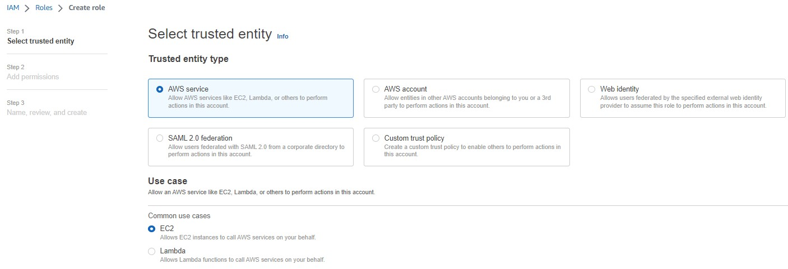

- Select the Trusted entity type and a use case, then click Next.
    - Since I'm selecting AWS service and EC2, we will need to attach the appropriate permissions on the next page.

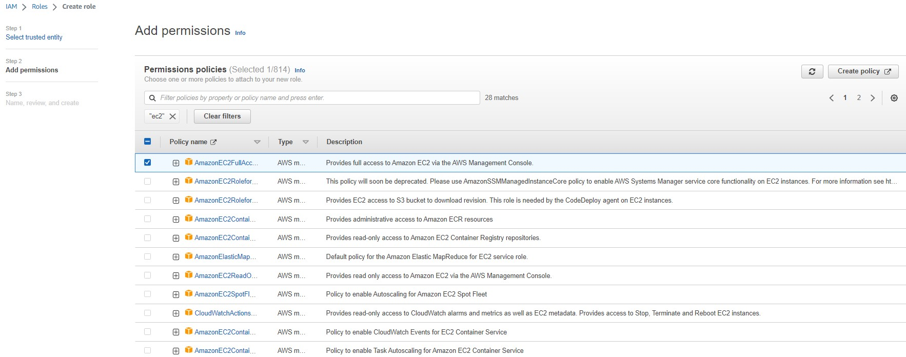

- Search for the appropriate permissions, in this instance I searched for EC2 and selected AmazonEC2FullAccess, then click Next.

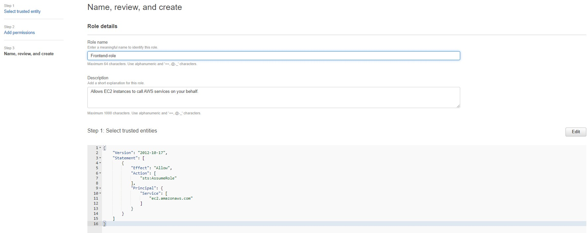

- Give your role a name then click Create role.

## Sign into admin user account to enable MFA & access keys
<a href="https://signin.aws.amazon.com/signin?redirect_uri=https%3A%2F%2Fus-east-2.console.aws.amazon.com%2Fconsole%2Fhome%3FhashArgs%3D%2523%26isauthcode%3Dtrue%26region%3Dus-east-2%26state%3DhashArgsFromTB_us-east-2_50d727ee5bfe22a4&client_id=arn%3Aaws%3Asignin%3A%3A%3Aconsole%2Fcanvas&forceMobileApp=0&code_challenge=XMwIMrRc4e00A59znlo2b66caHJ6TlAn0XmWTrPrYGI&code_challenge_method=SHA-256">AWS Signin Page</a>

Select IAM user

- Enter the 12 digit Account ID
- Click Next

- Enter the username & password.
- Click Sign in
- Enter in current/old password
- Enter in a new password
- Confirm new password
- Click Confirm password change

Once we have signed in, we will setup MFA by navigating to Security Credentials. You can access this by clicking on your username in the upper-right hand corner, then clicking on Security credentials.

From the next page "My security credentials", click Assign MFA. 

Specify the MFA device name, then choose an MFA device before clicking Next.

On the Set up device page, you will set up your authenticator app. 
- Install a compatible app like Google Authenticator, Duo Mobile, or Authy on your phone or computer. 
- Click on Show QR code; open your authenticator app then scan the code
- Fill in 2 consecutive codes from the MFA device
- Click Add MFA

On the next page you will see the banner below confirming the MFA device was successfully assigned! 

## Create Access Keys
From IAM, select the user then select Security Credentials.

- Click Create access key.
- Choose one of the options (We're setting up Access keys for the CLI) 

- Check the box to state you understand the above recommendation and want to proceed to create an access key.
- Click Next
- Set a description tag (optional)
- Click Create access key
- Retrieve your access key on the next page.

Optional: download your access key in a .csv file to import the file into the CLI. 
- We're using GitPod so we cannot use this option.

Best practices:
- Never store your access keys in plain text, in a code repository, or in code.
- Disable or delete access keys when no longer needed.
- Enable least-privilege permissions.
- Rotate access keys regularly.

# Install the AWS CLI
- We are going to install the AWS CLI when our Gitpod environment launches.
- We are going to set AWS CLI to use partial autoprompt mode to make it easier to debug CLI commands.
- The bash commands we are using are the same as the <a href="https://docs.aws.amazon.com/cli/latest/userguide/getting-started-install.html" >AWS CLI Installation Instructions</a>

Update our .gitpod.yml to include the following tasks:

    tasks:
    name: aws-cli
    env:
      AWS_CLI_AUTO_PROMPT: on-partial
    init: |
      cd /workspace
      curl "https://awscli.amazonaws.com/awscli-exe-linux-x86_64.zip" -o "awscliv2.zip"
      unzip awscliv2.zip
      sudo ./aws/install
      cd $THEIA_WORKSPACE_ROOT

We'll also run these commands individually to perform the install manually.

### Set Env Vars
We will set these credentials for the current bash terminal

    export AWS_ACCESS_KEY_ID=""
    export AWS_SECRET_ACCESS_KEY=""
    export AWS_DEFAULT_REGION=us-east-1

We'll tell Gitpod to remember these credentials if we relaunch our workspaces

    gp env AWS_ACCESS_KEY_ID=""
    gp env AWS_SECRET_ACCESS_KEY=""
    gp env AWS_DEFAULT_REGION=us-east-1

Check that the AWS CLI is working and you are the expected user
    
    aws sts get-caller-identity

# Create a Zero Spend Budget
After logging into the AWS Management Console, search for Budgets and create a budget. There are 2 main setup options available: Use a template and Customized. 

There are a few templates to choose from as well.

I'm choosing to setup a Zero spend budget called Zero Spend AWS Bootcamp Budget.

I deleted this budget and recreated it using budget.json in gitpod.

    aws budgets create-budget \
        --account-id $ACCOUNT_ID\
        --budget file://aws/json/budget.json \
        --notifications-with-subscribers file://aws/json/budget-notifications-with-subscribers.json

# Enable Billing
We need to turn on Billing Alerts to recieve alerts...

- In your Root Account go to the <a href="https://console.aws.amazon.com/billing/">Billing Page</a>
- Under Billing Preferences Choose Receive Billing Alerts
- Save Preferences 

# Creating a Billing Alarm
## Create SNS Topic
- We need an SNS topic before we create an alarm.
- The SNS topic is what will delivery us an alert when we get overbilled
- <a href="https://docs.aws.amazon.com/cli/latest/reference/sns/create-topic.html">aws sns create-topic</a>

We'll create a SNS Topic

    aws sns create-topic --name billing-alarm

which will return a TopicARN

We'll create a subscription supply the TopicARN and our Email

    aws sns subscribe \
        --topic-arn TopicARN \
        --protocol email \
        --notification-endpoint your@email.com

Check your email and confirm the subscription

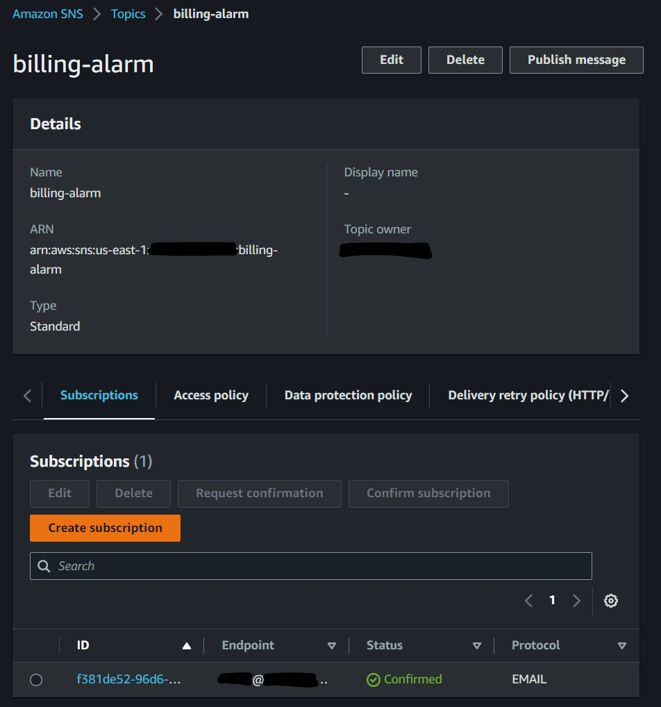

## Create Alarm
- <a href="https://docs.aws.amazon.com/cli/latest/reference/cloudwatch/put-metric-alarm.html">aws cloudwatch put-metric-alarm</a>
- <a href="https://aws.amazon.com/premiumsupport/knowledge-center/cloudwatch-estimatedcharges-alarm/">Create an Alarm via AWS CLI</a>
- We need to update the configuration json script with the TopicARN we generated earlier
- We are just a json file because --metrics is is required for expressions and so its easier to us a JSON file.

    aws cloudwatch put-metric-alarm --cli-input-json file://aws/json/alarm-config.json

# Setup EventBridge, hookup Health Dashboard to SNS for service health notifications
Search for Simple Notification Service (SNS) then create a topic.

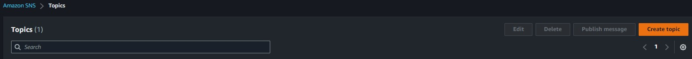

- Select the topic type (this cannot be modified after creation)
- Give the topic a name, for example I'm naming mine ServiceHealth.
    - Edit: I forgot to select Standard; this is something that will cause issues when creating the EventBridge later on. Make note and be sure to select Standard.
- Scroll down and click Create topic.

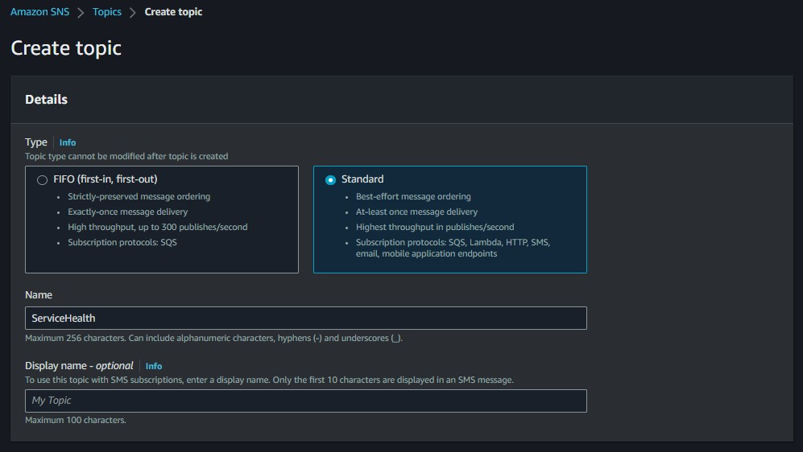

## Create EventBridge
Search for Health Dashboard.

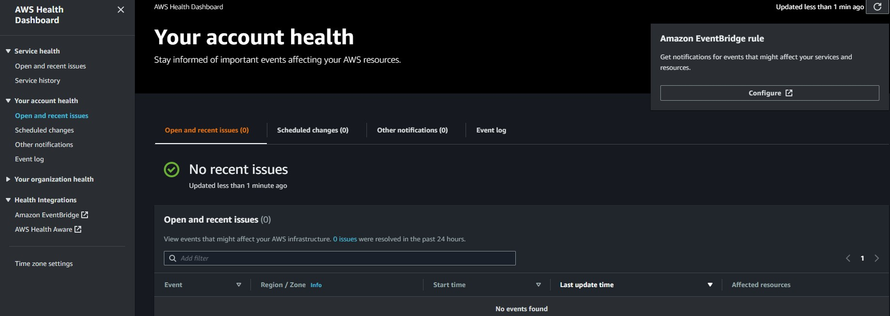

- Click Configure.
- Give your rule a name and click Next.

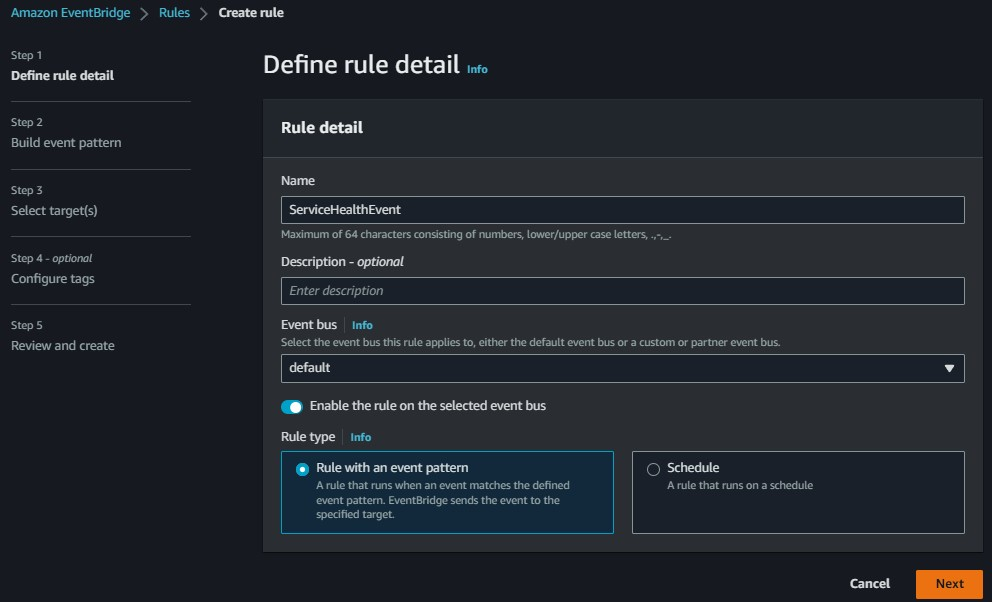

- Select the event source.
- Select a creation method.
- Create an event pattern.
    - Select the event source.
    - Select the AWS service.
    - Select the Event type
    - Any service or specific services (optional) - this defaults to Any service.
    - Any resource or specific resource(s) (optional) - the defaults to Any resource.
    - Click Next.

- Select the target type.
    - In this instance, I'm selecting SNS topic and ServiceHealth.fifo.
- Click Next.

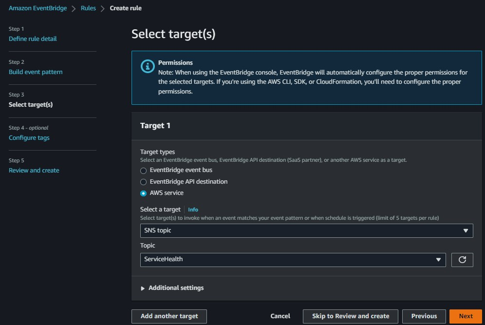

The next page is optional. You can add tags to label your AWS resources to search and filter the resources, or to track AWS costs.

- We're skipping this part, so click Next to review and create.

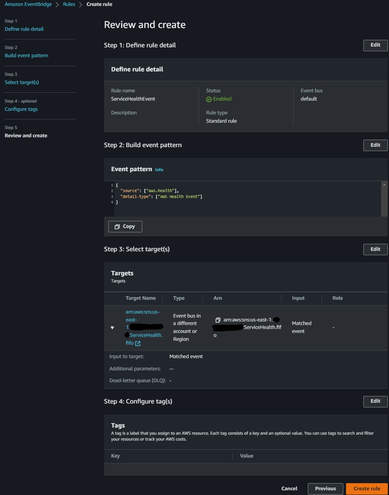

# Use CloudShell
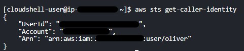

# Cloud Security
Watch <a href="https://youtu.be/4EMWBYVggQI">Ashish's Week 0 - Security Considerations video</a>
## What is Cloud Security?
Cybersecurity protects data, apps, and services associated with cloud environments from BOTH internal and external threats.

## Why should we care about Cloud Security?
- Reduces the impact of breach.
- Protects networks, apps, and services in cloud environments against malicious data theft.
- Reduces the human error that is responsible for data leaks.

## Why Cloud Security requires practice?
- Complexity.
- Always chasing our tail with new services announced throughout the year.
- Bad actors are always improving. 

## Why enable MFA for Root Account?
Root User is the most powerful user in your AWS environment with access to create new users.

In case of compromise, this account is the same as Domain Admin in the Cloud world.
- If a bad actor gains access to this account, they can create new users, services, etc. 
- ALWAYS enabled MFA on the Root User account.

## AWS Organizations
Helps manage security policies, cost policies, and billing in one central management account. The Root User is the management account. This account should not have any apps, it should only be used to create the org, the org unit, and all accounts within.

- How many types of Organizational Units (OU)
- Management Account
- Automate Vending Accounts w/Designated Owner for each AWS Account

## AWS CloudTrail
- Monitor data security & residence
- Understand the region vs availability zones vs global services concepts
- Audit logs for IR/Forensics

## AWS IAM User & Role Explained

## AWS Organization SCP Explained

## AWS SCP Best Practices
<a href="https://github.com/hashishrajan/aws-scp-best-practice-policies">hashishrajan's AWS SCP Best Practice Policies</a>
- Deny Guarduty Changes
- Deny Security Services Changes
- Restrict ALL Root Access
- Require MFA for AWS EC2 API Call
- Restrict IAM Users
- Restrict Root Permissions

## AWS Best Practices
Top 5 Security Practices
- Data Protection & Residency in accordance to Security Policy
- Identity & Access Management with Least Privilege
- Governance & Compliance of AWS Services being used
    - Global vs Regional Services
    - Compliant Services
- Shared Responsibility of Threat Detection
- Incident Response Plans to include Cloud

# Homework Summary
- What did I accomplish?
    - All required homework tasks without issue.
- Were there any obstacles (did I overcome them)?
    - N/A
- What were the homework challenges I attempted?
    - Destroy root account credentials, set MFA, and IAM role
    - Use EventBridge to hookup Health Dashboard to SNS & send notifications when any service health issues occur
    - Review all questions of each pillar in the Well-Architected Tool
    - Create an architectural diagram CI/CD logical pipeline in Lucid Charts