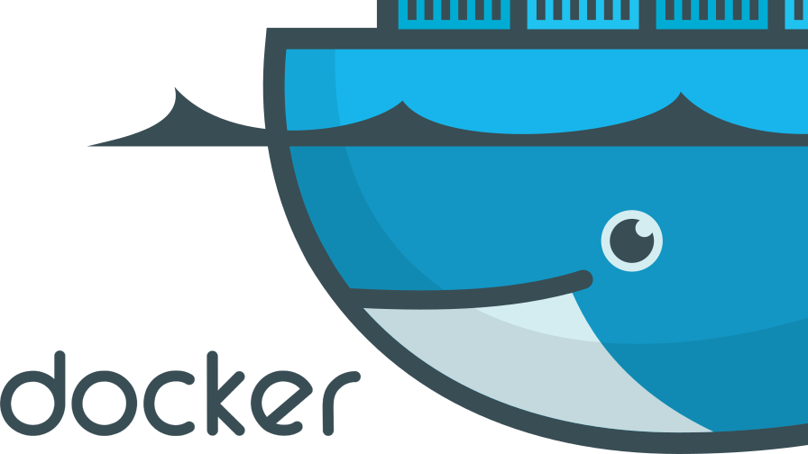
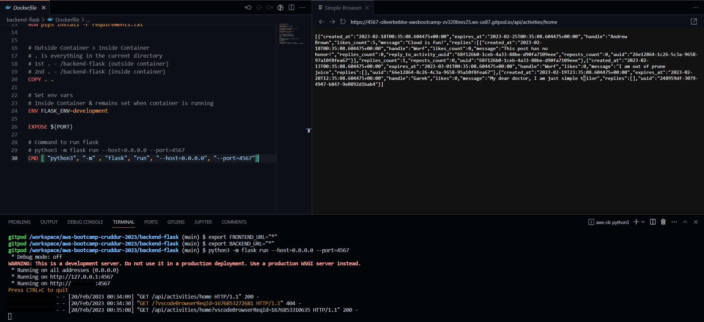
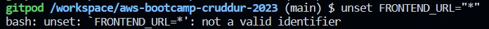
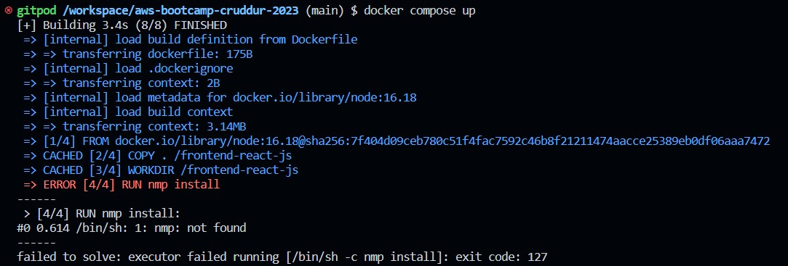
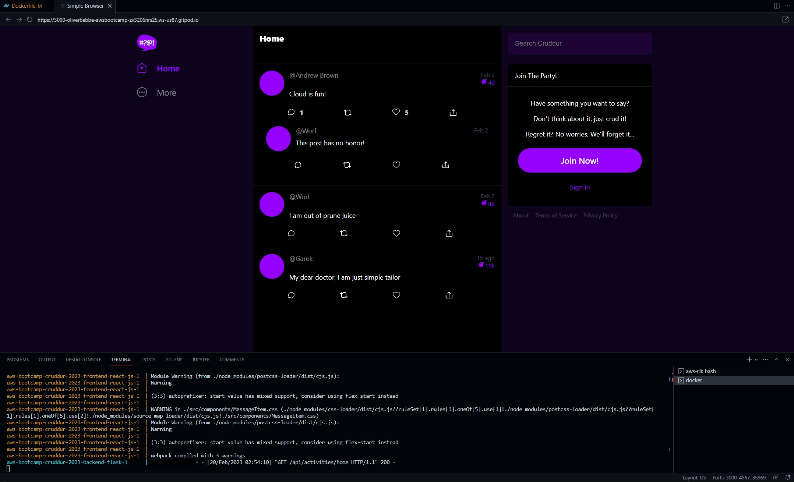
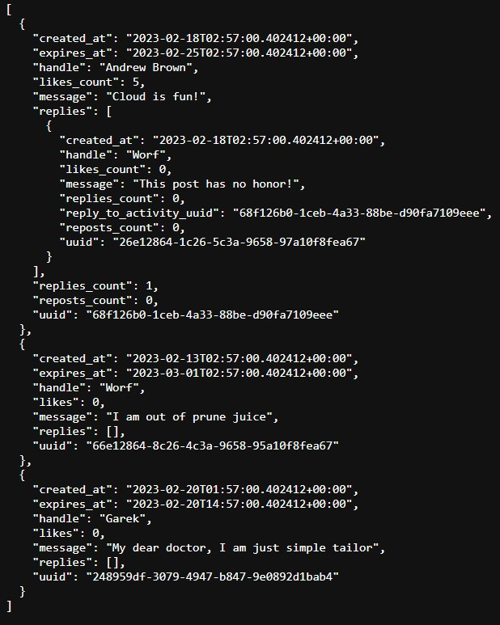
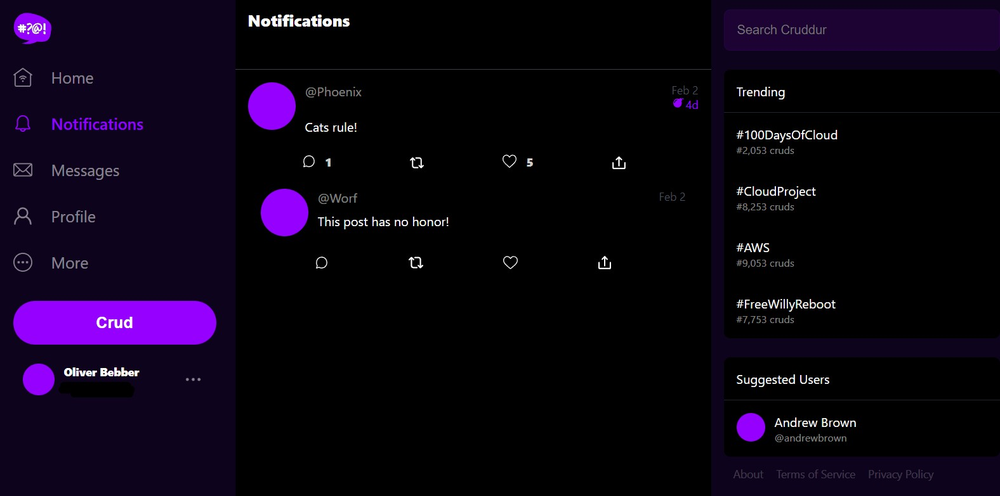
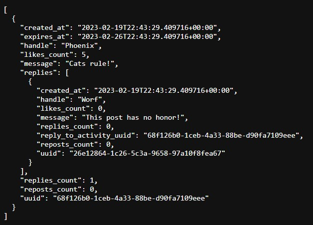

# Week 1 — App Containerization
## Livestream Technical Tasks
In this class, we are going to:
- [x] Create a new GitHub repo
- [x] Launch the repo within a Gitpod workspace
- [x] Configure Gitpod.yml configuration, eg. VSCode Extensions
- [x] Clone the frontend and backend repo
- [x] Explore the codebases
- [x] Ensure we can get the apps running locally
- [x] Write a Dockerfile for each app
- [x] Ensure we get the apps running via individual container
- [x] Create a docker-compose file
- [x] Ensure we can orchestrate multiple containers to run side by side
- [x] Mount directories so we can make changes while we code

## Required Homework
- [x] Watch <a href="https://www.youtube.com/watch?v=tDPqmwKMP7Y&list=PLBfufR7vyJJ7k25byhRXJldB5AiwgNnWv&index=29">How to Ask for Technical Help</a>
- [x] Watch <a href="https://www.youtube.com/watch?v=FKAScachFgk&list=PLBfufR7vyJJ7k25byhRXJldB5AiwgNnWv&index=25">Grading Homework Summaries</a>
- [x] Watch Week 1 - <a href="https://www.youtube.com/watch?v=zJnNe5Nv4tE&list=PLBfufR7vyJJ7k25byhRXJldB5AiwgNnWv&index=22">Live Stream</a>
- [x] <a href="https://www.youtube.com/watch?v=b-idMgFFcpg&list=PLBfufR7vyJJ7k25byhRXJldB5AiwgNnWv&index=23">Remember to Commit Your Code</a>
- [x] Watch Chirag's Week 1 - <a href="https://www.youtube.com/watch?v=OAMHu1NiYoI&list=PLBfufR7vyJJ7k25byhRXJldB5AiwgNnWv&index=24">Spending Considerations</a>
- [x] Watch Ashish's Week 1 - <a href="https://www.youtube.com/watch?v=OjZz4D0B-cA&list=PLBfufR7vyJJ7k25byhRXJldB5AiwgNnWv&index=24">Container Security</a>
- [x] <a href="https://www.youtube.com/watch?v=b-idMgFFcpg&list=PLBfufR7vyJJ7k25byhRXJldB5AiwgNnWv&index=23">Containerize Application (Dockerfiles, Docker Compose)</a>
- [x] <a href="https://www.youtube.com/watch?v=k-_o0cCpksk&list=PLBfufR7vyJJ7k25byhRXJldB5AiwgNnWv&index=27">Document the Notification Endpoint for the OpenAI Document</a>
- [x] <a href="https://www.youtube.com/watch?v=k-_o0cCpksk&list=PLBfufR7vyJJ7k25byhRXJldB5AiwgNnWv&index=27">Write a Flask Backend Endpoint for Notifications</a>
- [x] <a href="https://www.youtube.com/watch?v=k-_o0cCpksk&list=PLBfufR7vyJJ7k25byhRXJldB5AiwgNnWv&index=27">Write a React Page for Notifications</a>
- [ ] <a href="https://www.youtube.com/watch?v=CbQNMaa6zTg&list=PLBfufR7vyJJ7k25byhRXJldB5AiwgNnWv&index=28">Run DynamoDB Local Container & ensure it works</a>
- [ ] <a href="https://www.youtube.com/watch?v=CbQNMaa6zTg&list=PLBfufR7vyJJ7k25byhRXJldB5AiwgNnWv&index=28">Run Postgres Container & ensure it works</a>

## Homework Challenges
- [ ] Run the dockerfile CMD as an external script
  - https://docs.docker.com/engine/reference/builder/#run
- [ ] Push and tag a image to DockerHub (they have a free tier)
  - https://docs.docker.com/engine/reference/commandline/push/
  - https://docs.docker.com/engine/reference/commandline/tag/
- [ ] Use multi-stage building for a Dockerfile build
  - https://docs.docker.com/build/building/multi-stage/
- [ ] Implement a healthcheck in the V3 Docker compose file
  - https://docs.docker.com/engine/reference/builder/#healthcheck
  - https://medium.com/geekculture/how-to-successfully-implement-a-healthcheck-in-docker-compose-efced60bc08e
- [ ] Research best practices of Dockerfiles and attempt to implement it in your Dockerfile
  - https://docs.docker.com/develop/develop-images/dockerfile_best-practices/
- [ ] Learn how to install Docker on your localmachine and get the same containers running outside of Gitpod / Codespaces
  - https://docs.docker.com/desktop/install/windows-install/
  - https://docs.docker.com/desktop/install/mac-install/
- [ ] Launch an EC2 instance that has docker installed, and pull a container to demonstrate you can run your own docker processes. 




# Container Security
## What is Container Security?
The practice of protecting apps hosted on compute services like Containers. Common examples of apps can be Single Page Applications (SPAs), Microservices, APIs, etc.

- Container First Strategy
- Most apps are being developed with Containers & Cloud Native
- Reducing impact of breach - segregation of apps & related services
- Managed Container services means your security responsibility is focused on a few things (AWS ECS, AWS ECR next week)
- Automation can help reduce recovery times to a known good state quickly

## Why Container Security requires practice
- Complexity with Containers
- Relying on CSPs for features
- Unmanaged containers require more work than Managed containers
    - Managed containers are managed by the CSP

## Docker Architecture
Two main components
- Client
- Server

## Container Security Components
- Docker & Host Configuration
- Securing Images
- Secret Management
- Application Security
- Data Security
- Monitoring Containers
- Compliance Framework

## Security Best Practices
- Keep host & Docker updated with the latest security patches
- Docker daemon & containers should run in non-root user mode
- Image Vulnerability Scanning
    - Amazon Inspector
    - Clair requires a client and a server. It will download libraries to match if the image is vulnerable.
- Trusting a Private vs Public Image Registry
- No Sensitive Data in Dockerfiles or Images
- Use Secret Management Services to share secrets
    - AWS Secrets Manager can be used with some services, but not every service will integrate with it.
    - Hashicorp Vault is another option to use, there is a free and paid version. The free version requires managing the server and client yourself.
- Read-only file system & volume for Docker
- Separate databases for longterm storage
- Use DevSecOps practices while building application security
- Ensure all code is tested for vulnerabilities before releasing for production

Note: Container Escape is a security vulnerability that allows a bad actor to break out of a container and gain access to resources on the host operating system. This could compromise the security of the entire system. 

This vulnerability can be caused by a variety of factors:
- Kernel vulnerabilities
    - The host and the container share the same kernel, meaning kernel vulnerabilities may allow an attacker to break out of the container.
- Application vulnerabilities
    - If an app running inside the container has a vulnerability, this may be exploited to gain access to the host OS.
- Misconfigured container runtime
    - Misconfigurations can allow attackers to access additional resources.
- Privilege escalation
    - If a container has more permissions than required, such as running as the root user, an attacker might be able to use privilege escalation to gain access to the host OS. 

Container Escape can be avoided by following the security best practices mentioned above.

## Managed Container Services
Docker Compose and Docker containers work really well to build one app.
- The down side is that security patches and updates requires shutting down Docker, make the update, and restart the server. This can cause problems in enterprise environments.

AWS Managed Container Services can provide a better 

- AWS ECS
- AWS EKS
- AWS Fargate
- AWS App Runner
- AWS Copilot

# VSCode Docker Extension
Docker for VSCode makes it easy to work with Docker

https://code.visualstudio.com/docs/containers/overview

    Gitpod is preinstalled with theis extension

# Containerize Backend
## Run Python
```sh
cd backend-flask
export FRONTEND_URL="*"
export BACKEND_URL="*"
python3 -m flask run --host=0.0.0.0 --port=4567
cd ..
```

- Unlock the port on the port tab in Gitpod
- Open the link for port 4567
- Append /api/activities/home to the URL
- JSON should return in the browser



## Add Dockerfile
Create a file in backend-flask named Dockerfile

```dockerfile
FROM python:3.10-slim-buster

WORKDIR /backend-flask

COPY requirements.txt requirements.txt
RUN pip3 install -r requirements.txt

COPY . .

ENV FLASK_ENV=development

EXPOSE ${PORT}
CMD [ "python3", "-m" , "flask", "run", "--host=0.0.0.0", "--port=4567"]
```

## Build Container
```sh
docker build -t backend-flask ./backend-flask
```

Note: -t stands for tag. This flag will name the image, and provides the option for a tag in the format of 'name:tag'

- Docker will default to 'latest' tag but this is a default and doesn't necessarily mean it's the latest image.
- Treat 'latest' as a default tag.

## Run Container
```sh
docker run --rm -p 4567:4567 -it backend-flask
FRONTEND_URL="*" BACKEND_URL="*" docker run --rm -p 4567:4567 -it backend-flask
export FRONTEND_URL="*"
export BACKEND_URL="*"
docker run --rm -p 4567:4567 -it -e FRONTEND_URL='*' -e BACKEND_URL='*' backend-flask
docker run --rm -p 4567:4567 -it  -e FRONTEND_URL -e BACKEND_URL backend-flask
unset FRONTEND_URL="*"
unset BACKEND_URL="*"
```

NOTE: The above code is from the instructions however, I had to set BACKEND_URL & FRONTEND_URL to both ="*" before running docker run --rm -p 4567:4567 -it -e FRONTEND_URL='*' -e BACKEND_URL='*' backend-flask.


Run the following:

```sh
set BACKEND_URL="*"
set FRONTEND_URL="*"
docker run --rm -p 4567:4567 -it -e FRONTEND_URL='*' -e BACKEND_URL='*' backend-flask
```

NOTE: Navigate to the URL with /api/activities/home appended. 
- unset was not needed to removed the frontend & backend var.



Run in background
```sh
docker container -run --rm -p 4567:4567 -d backend-flask
```

Return the container id into an Env Var
```sh
CONTAINER_ID=$(docker run --rm -p 4567:4567 -d backend-flask)
```

> docker container run is idiomatic, docker run is legacy syntax but is commonly used.


# Containerize Frontend
## Install NPM
```
cd frontend-react-js
npm i
```

NOTE: if this returns an error, check your spelling. I had ```nmp i``` typed in. Otherwise, check to ensure you're in the correct directory.

## Create Dockerfile
Create a new Dockerfile in the frontend-react-js directory:
```dockerfile
FROM node:16.18

ENV PORT=3000

COPY . /frontend-react-js
WORKDIR /frontend-react-js
RUN npm install
EXPOSE ${PORT}
CMD ["npm", "start"]
```

## Run Frontend Container
```sh
docker run -p 3000:3000 -d frontend-react-js
```

# Multiple Containers
## Create `docker-compose.yml` in the root directory.

```yaml
version: "3.8"
services:
  backend-flask:
    environment:
      FRONTEND_URL: "https://3000-${GITPOD_WORKSPACE_ID}.${GITPOD_WORKSPACE_CLUSTER_HOST}"
      BACKEND_URL: "https://4567-${GITPOD_WORKSPACE_ID}.${GITPOD_WORKSPACE_CLUSTER_HOST}"
    build: ./backend-flask
    ports:
      - "4567:4567"
    volumes:
      - ./backend-flask:/backend-flask
  frontend-react-js:
    environment:
      REACT_APP_BACKEND_URL: "https://4567-${GITPOD_WORKSPACE_ID}.${GITPOD_WORKSPACE_CLUSTER_HOST}"
    build: ./frontend-react-js
    ports:
      - "3000:3000"
    volumes:
      - ./frontend-react-js:/frontend-react-js

# the name flag is a hack to change the default prepend folder
# name when outputting the image names
networks: 
  internal-network:
    driver: bridge
    name: cruddur
```

Right-click on `docker-compose.yml` file and click on Compose Up.
- Make sure you're in the root dir before you do this otherwise it may result in an error.
- You can also type in the following command:

```sh
docker compose up
```

- Hit an error due to a typo in the frontend Dockerfile.



Once docker compose up completed downloading the images, the app populated for a preview:

### Frontend Preview


### Backend Preview


# Create Front and Backend Notification Pages
## Edit ```openapi-3.0.yml``` to Create Notifications Section

```yml
 /api/activities/notifications:
    get:
      description: 'Return a feed of activity for all of my followers'
      tags:
        - activities
      parameters: []
      responses:
        '200':
          description: Returns an array of activities
          content:
            application/json:
              schema:
                type: array
                items:
                  $ref: '#/components/schemas/Activity'
```

## Write a Flask Backend Endpoint for Notifications
### Edit ```app.py``` to Create Notifications 
```py
@app.route("/api/activities/notifications", methods=['GET'])
def data_notifications():
  data = NotificationsActivities.run()
  return data, 200
```

Note: This section caused issues as I forgot to change ```data_home``` to be ```data_notifications```. Quickly noticed after looking at the errors I received when trying to load the notifications page within the app.

### Create ```notifications_activities.py```
```py
from datetime import datetime, timedelta, timezone
class NotificationsActivities:
  def run():
    now = datetime.now(timezone.utc).astimezone()
    results = [{
      'uuid': '68f126b0-1ceb-4a33-88be-d90fa7109eee',
      'handle':  'Phoenix',
      'message': 'Cats rule!',
      'created_at': (now - timedelta(days=2)).isoformat(),
      'expires_at': (now + timedelta(days=5)).isoformat(),
      'likes_count': 5,
      'replies_count': 1,
      'reposts_count': 0,
      'replies': [{
        'uuid': '26e12864-1c26-5c3a-9658-97a10f8fea67',
        'reply_to_activity_uuid': '68f126b0-1ceb-4a33-88be-d90fa7109eee',
        'handle':  'Worf',
        'message': 'This post has no honor!',
        'likes_count': 0,
        'replies_count': 0,
        'reposts_count': 0,
        'created_at': (now - timedelta(days=2)).isoformat()
      }],
    }
    ]
    return results
```


## Frontend React Notification Page


## Backend Flask Notification Page
