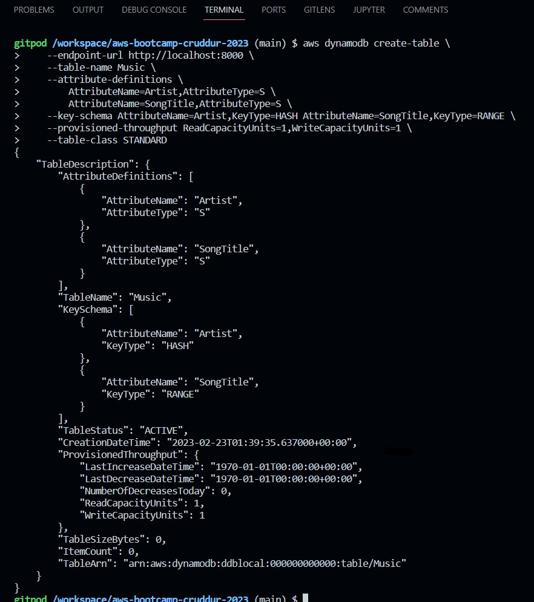
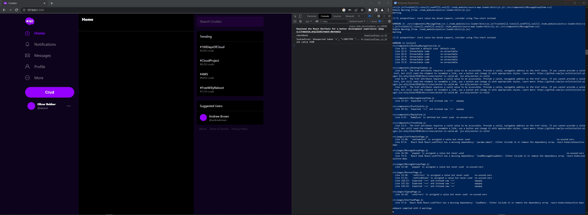

# Week 1 — App Containerization
## Livestream Technical Tasks
In this class, we are going to:
- [x] Create a new GitHub repo
- [x] Launch the repo within a Gitpod workspace
- [x] Configure Gitpod.yml configuration, eg. VSCode Extensions
- [x] Clone the frontend and backend repo
- [x] Explore the codebases
- [x] Ensure we can get the apps running locally
- [x] Write a Dockerfile for each app
- [x] Ensure we get the apps running via individual container
- [x] Create a docker-compose file
- [x] Ensure we can orchestrate multiple containers to run side by side
- [x] Mount directories so we can make changes while we code

## Required Homework
- [x] Watch <a href="https://www.youtube.com/watch?v=tDPqmwKMP7Y&list=PLBfufR7vyJJ7k25byhRXJldB5AiwgNnWv&index=29">How to Ask for Technical Help</a>
- [x] Watch <a href="https://www.youtube.com/watch?v=FKAScachFgk&list=PLBfufR7vyJJ7k25byhRXJldB5AiwgNnWv&index=25">Grading Homework Summaries</a>
- [x] Watch Week 1 - <a href="https://www.youtube.com/watch?v=zJnNe5Nv4tE&list=PLBfufR7vyJJ7k25byhRXJldB5AiwgNnWv&index=22">Live Stream</a>
- [x] <a href="https://www.youtube.com/watch?v=b-idMgFFcpg&list=PLBfufR7vyJJ7k25byhRXJldB5AiwgNnWv&index=23">Remember to Commit Your Code</a>
- [x] Watch Chirag's Week 1 - <a href="https://www.youtube.com/watch?v=OAMHu1NiYoI&list=PLBfufR7vyJJ7k25byhRXJldB5AiwgNnWv&index=24">Spending Considerations</a>
- [x] Watch Ashish's Week 1 - <a href="https://www.youtube.com/watch?v=OjZz4D0B-cA&list=PLBfufR7vyJJ7k25byhRXJldB5AiwgNnWv&index=24">Container Security</a>
- [x] <a href="https://github.com/oliverbebber/aws-bootcamp-cruddur-2023/blob/main/journal/week1.md#containerize-application---dockerfiles-docker-compose">Containerize Application (Dockerfiles, Docker Compose)</a>
- [x] <a href="https://github.com/oliverbebber/aws-bootcamp-cruddur-2023/blob/main/journal/week1.md#create-notification-endpoint-for-the-openapi-file">Document the Notification Endpoint for the OpenAPI Document</a>
- [x] <a href="">Write a Flask Backend Endpoint for Notifications</a>
- [x] <a href="">Write a React Page for Notifications</a>
- [x] <a href="https://github.com/oliverbebber/aws-bootcamp-cruddur-2023/blob/main/journal/week1.md#add-dynamodb-local-to-docker-composeyml">Run DynamoDB Local Container & ensure it works</a>
- [x] <a href="https://github.com/oliverbebber/aws-bootcamp-cruddur-2023/blob/main/journal/week1.md#add-postgres-to-docker-composeyml">Run Postgres Container & ensure it works</a>

## <a href="https://github.com/oliverbebber/aws-bootcamp-cruddur-2023/blob/main/journal/week1.md#homework-challenges-1">Homework Challenges</a>
- [ ] Run the dockerfile CMD as an external script
  - https://docs.docker.com/engine/reference/builder/#run
- [x] <a href="https://github.com/oliverbebber/aws-bootcamp-cruddur-2023/blob/main/journal/week1.md#push-and-tag-an-image-to-docker-hub">Push and tag a image to DockerHub</a> (they have a free tier)
  - https://docs.docker.com/engine/reference/commandline/push/
  - https://docs.docker.com/engine/reference/commandline/tag/
- [ ] Use multi-stage building for a Dockerfile build
  - https://docs.docker.com/build/building/multi-stage/
- [ ] Implement a healthcheck in the V3 Docker compose file
  - https://docs.docker.com/engine/reference/builder/#healthcheck
  - https://medium.com/geekculture/how-to-successfully-implement-a-healthcheck-in-docker-compose-efced60bc08e
  - https://medium.com/@saklani1408/configuring-healthcheck-in-docker-compose-3fa6439ee280
  - https://www.chubbydeveloper.com/docker-compose-healthcheck/
- [ ] Research best practices of Dockerfiles and attempt to implement it in your Dockerfile
  - https://docs.docker.com/develop/develop-images/dockerfile_best-practices/
- [x] <a href="https://github.com/oliverbebber/aws-bootcamp-cruddur-2023/blob/main/journal/week1.md#install-docker-locally">Learn how to install Docker on your localmachine and get the same containers running outside of Gitpod / Codespaces</a>
  - https://docs.docker.com/desktop/install/windows-install/
  - https://docs.docker.com/desktop/install/mac-install/
- [ ] Launch an EC2 instance that has docker installed, and pull a container to demonstrate you can run your own docker processes. 


# Container Security
## What is Container Security?
The practice of protecting apps hosted on compute services like Containers. Common examples of apps can be Single Page Applications (SPAs), Microservices, APIs, etc.

- Container First Strategy
- Most apps are being developed with Containers & Cloud Native
- Reducing impact of breach - segregation of apps & related services
- Managed Container services means your security responsibility is focused on a few things (AWS ECS, AWS ECR next week)
- Automation can help reduce recovery times to a known good state quickly

## Why Container Security requires practice
- Complexity with Containers
- Relying on CSPs for features
- Unmanaged containers require more work than Managed containers
    - Managed containers are managed by the CSP

## Docker Architecture
Two main components
- Client
- Server

## Container Security Components
- Docker & Host Configuration
- Securing Images
- Secret Management
- Application Security
- Data Security
- Monitoring Containers
- Compliance Framework

## Security Best Practices
- Keep host & Docker updated with the latest security patches
- Docker daemon & containers should run in non-root user mode
- Image Vulnerability Scanning
    - Amazon Inspector
    - Clair requires a client and a server. It will download libraries to match if the image is vulnerable.
- Trusting a Private vs Public Image Registry
- No Sensitive Data in Dockerfiles or Images
- Use Secret Management Services to share secrets
    - AWS Secrets Manager can be used with some services, but not every service will integrate with it.
    - Hashicorp Vault is another option to use, there is a free and paid version. The free version requires managing the server and client yourself.
- Read-only file system & volume for Docker
- Separate databases for longterm storage
- Use DevSecOps practices while building application security
- Ensure all code is tested for vulnerabilities before releasing for production

Note: Container Escape is a security vulnerability that allows a bad actor to break out of a container and gain access to resources on the host operating system. This could compromise the security of the entire system. 

This vulnerability can be caused by a variety of factors:
- Kernel vulnerabilities
    - The host and the container share the same kernel, meaning kernel vulnerabilities may allow an attacker to break out of the container.
- Application vulnerabilities
    - If an app running inside the container has a vulnerability, this may be exploited to gain access to the host OS.
- Misconfigured container runtime
    - Misconfigurations can allow attackers to access additional resources.
- Privilege escalation
    - If a container has more permissions than required, such as running as the root user, an attacker might be able to use privilege escalation to gain access to the host OS. 

Container Escape can be avoided by following the security best practices mentioned above.

## Managed Container Services
Docker Compose and Docker containers work really well to build one app.
- The down side is that security patches and updates requires shutting down Docker, make the update, and restart the server. This can cause problems in enterprise environments.

AWS Managed Container Services can provide a better 

- AWS ECS
- AWS EKS
- AWS Fargate
- AWS App Runner
- AWS Copilot

# VSCode Docker Extension
Docker for VSCode makes it easy to work with Docker

https://code.visualstudio.com/docs/containers/overview

    Gitpod is preinstalled with theis extension


# Containerize Application - Dockerfiles, Docker Compose
## Containerize Backend
## Run Python
```sh
cd backend-flask
export FRONTEND_URL="*"
export BACKEND_URL="*"
python3 -m flask run --host=0.0.0.0 --port=4567
cd ..
```

- Unlock the port on the port tab in Gitpod
- Open the link for port 4567
- Append /api/activities/home to the URL
- JSON should return in the browser


## Add Dockerfile
Create a file in backend-flask named Dockerfile

```dockerfile
FROM python:3.10-slim-buster

WORKDIR /backend-flask

COPY requirements.txt requirements.txt
RUN pip3 install -r requirements.txt

COPY . .

ENV FLASK_ENV=development

EXPOSE ${PORT}
CMD [ "python3", "-m" , "flask", "run", "--host=0.0.0.0", "--port=4567"]
```

## Build Container
```sh
docker build -t backend-flask ./backend-flask
```

Note: -t stands for tag. This flag will name the image, and provides the option for a tag in the format of 'name:tag'

- Docker will default to 'latest' tag but this is a default and doesn't necessarily mean it's the latest image.
- Treat 'latest' as a default tag.

## Run Container
```sh
docker run --rm -p 4567:4567 -it backend-flask
FRONTEND_URL="*" BACKEND_URL="*" docker run --rm -p 4567:4567 -it backend-flask
export FRONTEND_URL="*"
export BACKEND_URL="*"
docker run --rm -p 4567:4567 -it -e FRONTEND_URL='*' -e BACKEND_URL='*' backend-flask
docker run --rm -p 4567:4567 -it  -e FRONTEND_URL -e BACKEND_URL backend-flask
unset FRONTEND_URL="*"
unset BACKEND_URL="*"
```

NOTE: The above code is from the instructions however, I had to set BACKEND_URL & FRONTEND_URL to both ="*" before running docker run --rm -p 4567:4567 -it -e FRONTEND_URL='*' -e BACKEND_URL='*' backend-flask.


Run the following:

```sh
set BACKEND_URL="*"
set FRONTEND_URL="*"
docker run --rm -p 4567:4567 -it -e FRONTEND_URL='*' -e BACKEND_URL='*' backend-flask
```

NOTE: Navigate to the URL with /api/activities/home appended. 
- unset was not needed to removed the frontend & backend var.


Run in background
```sh
docker container -run --rm -p 4567:4567 -d backend-flask
```

Return the container id into an Env Var
```sh
CONTAINER_ID=$(docker run --rm -p 4567:4567 -d backend-flask)
```

> docker container run is idiomatic, docker run is legacy syntax but is commonly used.


## Containerize Frontend
## Install NPM
```
cd frontend-react-js
npm i
```

NOTE: if this returns an error, check your spelling. I had ```nmp i``` typed in. Otherwise, check to ensure you're in the correct directory.

## Create Dockerfile
Create a new Dockerfile in the frontend-react-js directory:
```dockerfile
FROM node:16.18

ENV PORT=3000

COPY . /frontend-react-js
WORKDIR /frontend-react-js
RUN npm install
EXPOSE ${PORT}
CMD ["npm", "start"]
```

## Run Frontend Container
```sh
docker run -p 3000:3000 -d frontend-react-js
```

# Multiple Containers
## Create `docker-compose.yml` in the root directory.

```yaml
version: "3.8"
services:
  backend-flask:
    environment:
      FRONTEND_URL: "https://3000-${GITPOD_WORKSPACE_ID}.${GITPOD_WORKSPACE_CLUSTER_HOST}"
      BACKEND_URL: "https://4567-${GITPOD_WORKSPACE_ID}.${GITPOD_WORKSPACE_CLUSTER_HOST}"
    build: ./backend-flask
    ports:
      - "4567:4567"
    volumes:
      - ./backend-flask:/backend-flask
  frontend-react-js:
    environment:
      REACT_APP_BACKEND_URL: "https://4567-${GITPOD_WORKSPACE_ID}.${GITPOD_WORKSPACE_CLUSTER_HOST}"
    build: ./frontend-react-js
    ports:
      - "3000:3000"
    volumes:
      - ./frontend-react-js:/frontend-react-js

# the name flag is a hack to change the default prepend folder
# name when outputting the image names
networks: 
  internal-network:
    driver: bridge
    name: cruddur
```

Right-click on `docker-compose.yml` file and click on Compose Up.
- Make sure you're in the root dir before you do this otherwise it may result in an error.
- You can also type in the following command:

```sh
docker compose up
```

- Hit an error due to a typo in the frontend Dockerfile.


# Create Front and Backend Notification Pages
## Edit ```openapi-3.0.yml``` to Create Notifications Section

```yml
 /api/activities/notifications:
    get:
      description: 'Return a feed of activity for all of my followers'
      tags:
        - activities
      parameters: []
      responses:
        '200':
          description: Returns an array of activities
          content:
            application/json:
              schema:
                type: array
                items:
                  $ref: '#/components/schemas/Activity'
```


# Create Notification Endpoint for the OpenAPI File
### Edit ```app.py``` to Create Notifications 
```py
@app.route("/api/activities/notifications", methods=['GET'])
def data_notifications():
  data = NotificationsActivities.run()
  return data, 200
```

Note: This section caused issues as I forgot to change ```data_home``` to be ```data_notifications```. Quickly noticed after looking at the errors I received when trying to load the notifications page within the app.
# Write a Flask Backend Endpoint for Notifications
### Create ```notifications_activities.py```
```py
from datetime import datetime, timedelta, timezone
class NotificationsActivities:
  def run():
    now = datetime.now(timezone.utc).astimezone()
    results = [{
      'uuid': '68f126b0-1ceb-4a33-88be-d90fa7109eee',
      'handle':  'Phoenix',
      'message': 'Cats rule!',
      'created_at': (now - timedelta(days=2)).isoformat(),
      'expires_at': (now + timedelta(days=5)).isoformat(),
      'likes_count': 5,
      'replies_count': 1,
      'reposts_count': 0,
      'replies': [{
        'uuid': '26e12864-1c26-5c3a-9658-97a10f8fea67',
        'reply_to_activity_uuid': '68f126b0-1ceb-4a33-88be-d90fa7109eee',
        'handle':  'Worf',
        'message': 'This post has no honor!',
        'likes_count': 0,
        'replies_count': 0,
        'reposts_count': 0,
        'created_at': (now - timedelta(days=2)).isoformat()
      }],
    }
    ]
    return results
```


## Frontend React Notification Page


# Adding DynamoDB Local and Postgres
## Add DynamoDB Local to ```docker-compose.yml```
```yml
services:
  dynamodb-local:
    # https://stackoverflow.com/questions/67533058/persist-local-dynamodb-data-in-volumes-lack-permission-unable-to-open-databa
    # We needed to add user:root to get this working.
    user: root
    command: "-jar DynamoDBLocal.jar -sharedDb -dbPath ./data"
    image: "amazon/dynamodb-local:latest"
    container_name: dynamodb-local
    ports:
      - "8000:8000"
    volumes:
      - "./docker/dynamodb:/home/dynamodblocal/data"
    working_dir: /home/dynamodblocal
```

Example of using DynamoDB local https://github.com/100DaysOfCloud/challenge-dynamodb-local

## Ensure DynamoDB works
### Create a table


### Create an item & list table


### Get records


## Add Postgres to ```docker-compose.yml```
```yml
services:
  db:
    image: postgres:13-alpine
    restart: always
    environment:
      - POSTGRES_USER=postgres
      - POSTGRES_PASSWORD=password
    ports:
      - '5432:5432'
    volumes: 
      - db:/var/lib/postgresql/data
volumes:
  db:
    driver: local
```

To install the postgres client into Gitpod:

```sh
  - name: postgres
    init: |
      curl -fsSL https://www.postgresql.org/media/keys/ACCC4CF8.asc|sudo gpg --dearmor -o /etc/apt/trusted.gpg.d/postgresql.gpg
      echo "deb http://apt.postgresql.org/pub/repos/apt/ `lsb_release -cs`-pgdg main" |sudo tee  /etc/apt/sources.list.d/pgdg.list
      sudo apt update
      sudo apt install -y postgresql-client-13 libpq-dev
```

## Ensure Postgres works


# Homework Challenges
## Install Docker Desktop & Run Containers Locally
For Windows: Download Docker from https://desktop.docker.com/win/main/amd64/Docker%20Desktop%20Installer.exe

I used PowerShell when I installed Docker locally, so I used the following command after changing directories to where I downloaded the executable:

```ps
Start-Process 'Docker Desktop Installer.exe' -Wait install
```

I ended up needing to enable WSL 2 as this is the first time I've done any development while using Windows. The following resource may be useful if you have never enabled Windows Subsystem for Linux: https://learn.microsoft.com/en-us/windows/wsl/install

Once Docker Desktop is installed, open the app and login.

Open your terminal and run the following command:

```docker
docker run -d -p 80:80 docker/getting-started
```

- ```-d``` runs the container in detached mode, or in the background.
- ```-p 80:80``` maps port 80 of the host to port 80 of the container.
- ```docker/getting-started``` is the image that will be used.

NOTE: You can combine the ```-d``` & ```-p``` flags to shorten the command as seen below:

```docker
docker run -dp 80:80 docker/getting-started
```

### Now to pull & run the containers!
- Open PowerShell
- Pull the container image(s)

```ps
docker pull dockerhub-username/repo-name:tag
```

Next, we need to run the containers that we just pulled. Run the following command in PowerShell:


```ps
docker run -p 3000:3000 dockerhub-username/repo-name:tag
```





```ps
docker run -p 4567:4567 dockerhub-username/repo-name:tag
```


Note: The frontend is up and functioning, however, I have run into errors running the backend-flask image locally. I will need to investigate this further over the weekend, after work. 


## Docker Hub 
Before the bootcamp, I had created a Docker Hub account, however, I never pushed an image, nor had I ever tagged an image.

If you don't have a Docker Hub account, you can create one by going to https://hub.docker.com/

## Login using the terminal
Run the following command

```
docker login
```

Enter your username and password.
- For enhanced security, use an access token.
  
To login with an access token:  

```
docker login -u <username>
```

Then enter your access token when prompted for your password.

## Create an access token
Log in to https://hub.docker.com

- Click on your username in the upper right
- Click on Account Settings
- Click on Security > New Access Tokens

- Give the Access Token a description
- Click the drop-down menu and select the appropriate access permissions
- Click Generate
- Copy the token and save it in a safe place. 
  - NOTE: You will NOT be able to regenerate your token after closing this page.

For more info: <a href="https://docs.docker.com/docker-hub/access-tokens/">Manage Access Tokens - Docker Documentation</a>

## Create a new (public) repository
- Click the Repsitories tab at the top of Docker Hub.


- Click Create repository
- Name the repository
- Be sure to set it's visibility public


- Click Create

# Push and tag an image to Docker Hub
Navigate back to Gitpod

Install npm in ```frontend-react-js```

```sh
cd frontend-react-js
npm i
cd ..
```

```
docker compose up
docker images
```


```
docker tag image-name dockerhub-username/repo-name:tag
docker push image-name dockerhub-username/repo-name:tag
```

<a href="https://hub.docker.com/r/oliverbebber/aws-bootcamp-cruddur-2023-frontend-react-js/tags"></a>

<a href="https://hub.docker.com/r/oliverbebber/aws-bootcamp-cruddur-2023-backend-flask/tags"></a>


- I regret making my image name/repo name so long. I will be changing this ASAP 

# Best Practices for Writing Dockerfiles
Docker builds images automatically by reading the instructions within a Dockerfile.
- A Dockerfile is a text file that contains all commands, in order, required to build a docker image.
  - There is a specifc format that needs to be followed.
  - To learn more: https://docs.docker.com/engine/reference/builder/

## What is a Docker image?
A Docker image is made up of read-only layers that represent a Dockerfile instruction.

Each instruction within a Dockerfile creates one layer.

For example: 
```dockerfile
FROM node:16.18

ENV PORT=3000

COPY . /frontend-react-js
WORKDIR /frontend-react-js
RUN npm install
EXPOSE ${PORT}
CMD ["npm", "start"]
```

- ```FROM``` creates a layer from the ```node:16.18``` Docker image.
- ```COPY``` adds files from our Docker client's current directory.
- ```RUN``` builds our app by installing ```npm```.
- ```CMD``` specifies the command to run within the container.

## Guidelines & Recommendations
### Create ephemeral containers
Images defined by Dockerfiles should generate containers that are as ephemeral as possible.
- This means the container can be stopped & destroyed, then rebuilt & replaced with minimumal set up and configuration.

### Pipe Dockerfile through stdin
Docker has the ability to build images by piping a Dockerfile through stdin with a local or remote build context. Piping a Dockerfile through stdin can be helpful to perform one-off builds without writing a Dockerfile to disk, or in situations where the Dockerfile is generated and shouldn't remain afterwards.
- Any method to provide the Dockerfile on stdin can be used.

The following are equivalent:

```sh
echo -e 'FROM busybox\nRUN echo "hello world"' | docker build -
```

```docker
docker build -<<EOF
FROM busybox
RUN echo "hello world"
EOF
```


### Build an image using a Dockerfile from stdin, without sending build context
Use this syntax to build an image using a Dockerfile from stdin, without sending additional files as build context.

```
docker build [OPTIONS] -
```

The hyphen takes the position of the ```PATH``` and instructs Docker to read the build context, which only contains  Dockerfile from the stdin, instead of a directory.

The example below builds an image using a Dockerfile that is passed through stdin.
- No files are sent as build context to the daemon.

```docker
docker build -t myimage:latest -<<EOF
FROM busybox
RUN echo "hello world"
EOF
```

Omitting the build context can be beneficial in situations where the Dockerfile doesn't require files to be copied into the image, which can improve build-speed, since no files are sent to the daemon.

To improve build-speed by excluding some files from the build context, exclude with ```.dockerignore```.

### Build from a local build context, using a Dockerfile from stdin


### Build from a remote build context, using a Dockerfile from stdin

### Exclude with ```.dockerignore```


### Use multi-stage builds
Multi-stage builds allow you to drastically reduce the size of your final image, without issue reducing the number of intermediate layers and files.

Images are built during the final stage of the build process, which allows you to minimize image layers by leveraging build cache.

The following is an example of the order of instructions:
1. Install tools you need to build your app.
2. Install or update library dependencies.
3. Generate the app.


# Use multi-stage building for a Dockerfile build
Each ```RUN```, ```COPY```, and ```ADD``` instruction in a Dockerfile adds a layer to the image, which can make it challenging to keep the image size down. You need to remember to cleanup any unnecessary artifacts before moving on to the next layer.

To write efficient Dockerfiles, shell tricks and other logic has been needed to keep the layers as small as possible to ensure each layer has only the artifacts that it needs from the previous layer and nothing more.

Using multi-stage builds, you use multiple ```FROM``` statements witin the Dockerfile. 
- Each ```FROM``` instruction can use a different base, and from each, a new stage of the build begins.
- This allows you to selectively copy artifacts from one stage to another, leaving anything you don't want or need in the final image. 


# Docker Image Security Best Practices
Reference: https://res.cloudinary.com/snyk/image/upload/v1551798390/Docker_Image_Security_Best_Practices_.pdf
## Least privileged user
Create a dedicated user & group on the image, with minimal permissions to run the app.
- The same user should be used to run the process.

## Digital signatures & signature verification
A lot of trust is put into docker images. It's extremely important to make sure the image that's being pulled is pushed by the publisher and hasn't been tampered with.
- Sign images
- Verify the trust & authenticity of the images you pull

## Remediate open source vulnerabilities
Do NOT skip this step. Scan your docker images for known vulns and integrate it as part of your continuous integration. 
- Synk was mentioned in one of our homework video assignments and can be used for this purpose. They have a free tier!

# Homework Summary
What did I accomplish?
- All required homework assignments and some homework challenges.

Were there any obstacles (did I overcome them)?
I ran into a few errors along the way, mostly due to typos.
- Running docker compose up threw an error and pointed out the typo.
I ran into an issue while writing the backend endpoint for notifications, as I forgot to change 'data_home' to 'data_notifications'.
- Navigation to the page and hitting a 404 led me to reviewing docker logs and the app.py code.

While spinning up my local containers, I ran into a TypeError: argument of type "NoneType" is not iterable but have not had time to research this as it's late and I work early in the morning. I will be looking further into this after work and after catching up on the livestream video.

What were the homework challenges I attempted?
- Push and tag an image to DockerHub.
- I used a naming convention I ended up regretting. Changing it to a shorter version this weekend.
- Installed Docker on my local machine and run the containers outside of Gitpod.
- I ran into an issue with the backend. With it being late and having work early in the morning, I won't get to investigate this until after homework is due. My findings will be posted in my journal.