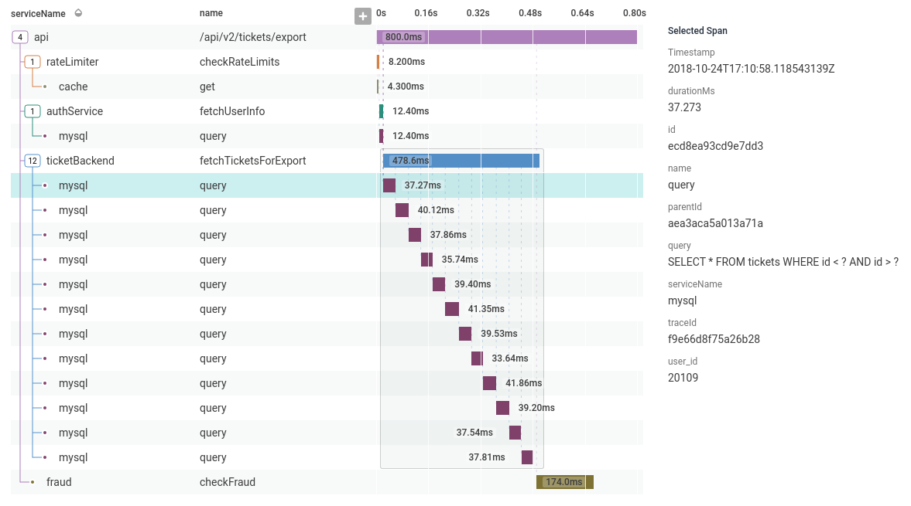
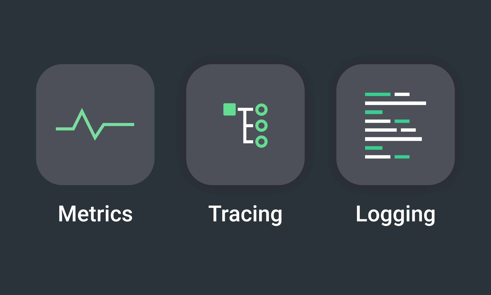
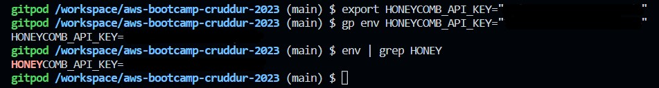
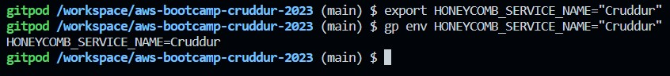
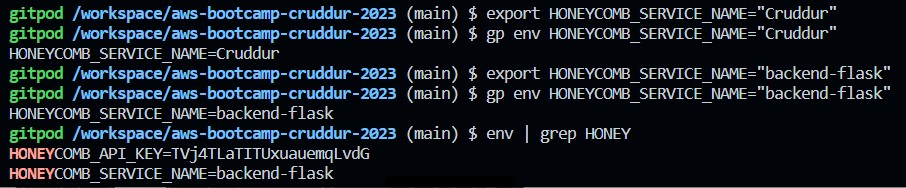
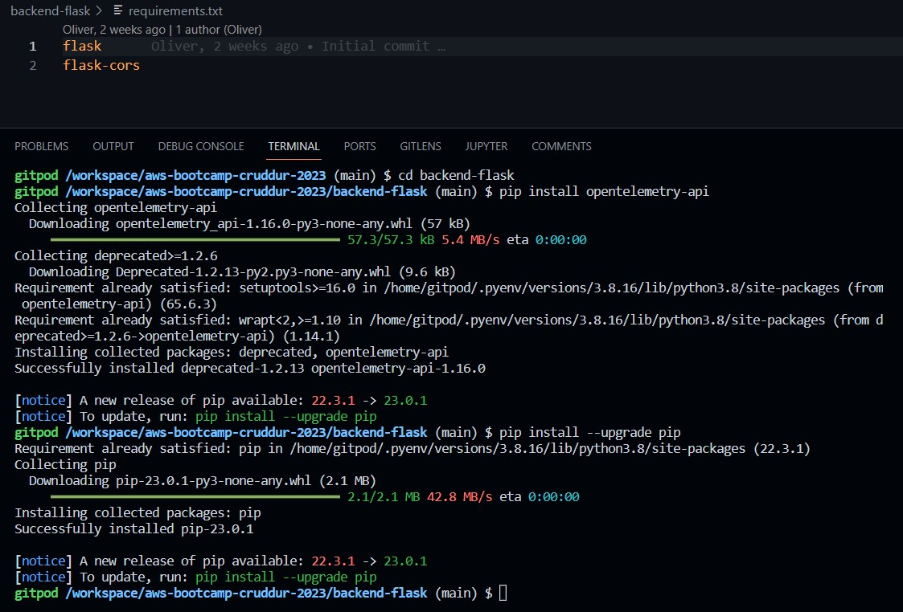
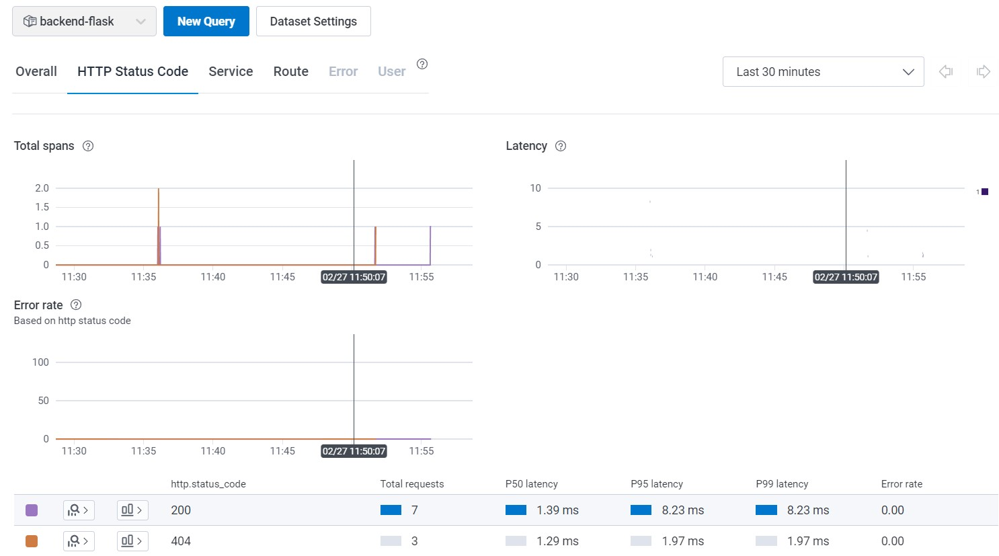
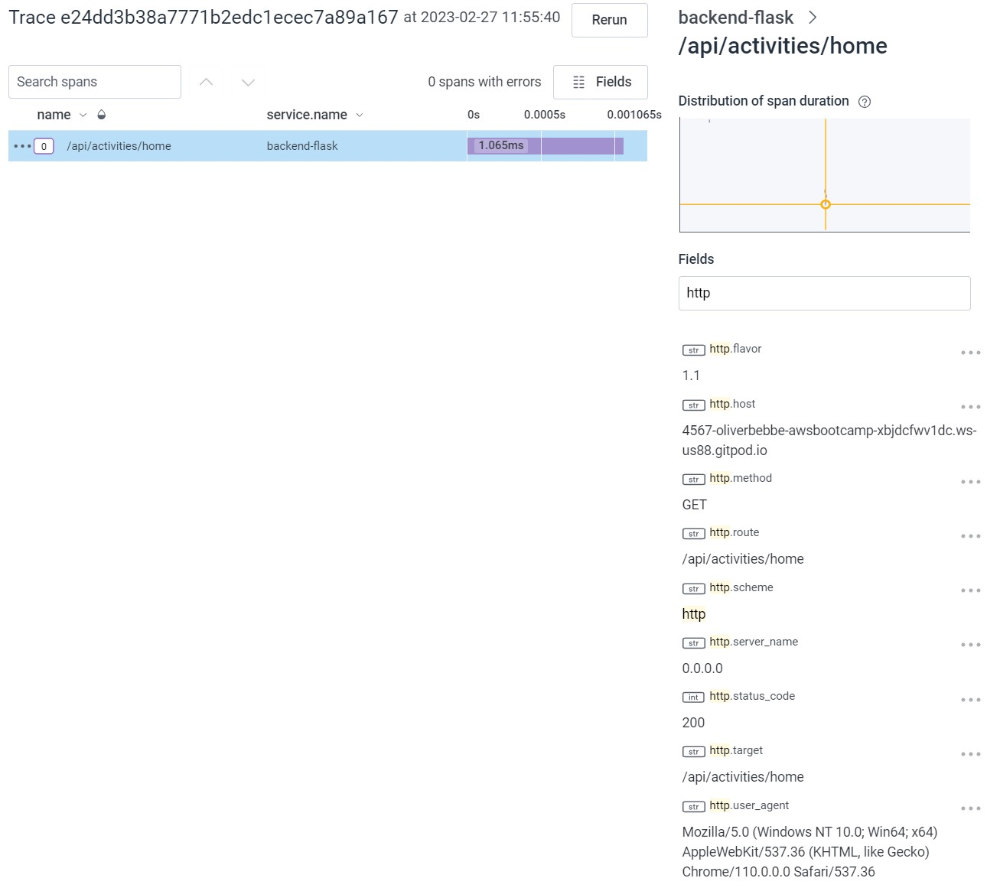
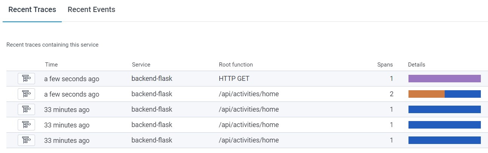
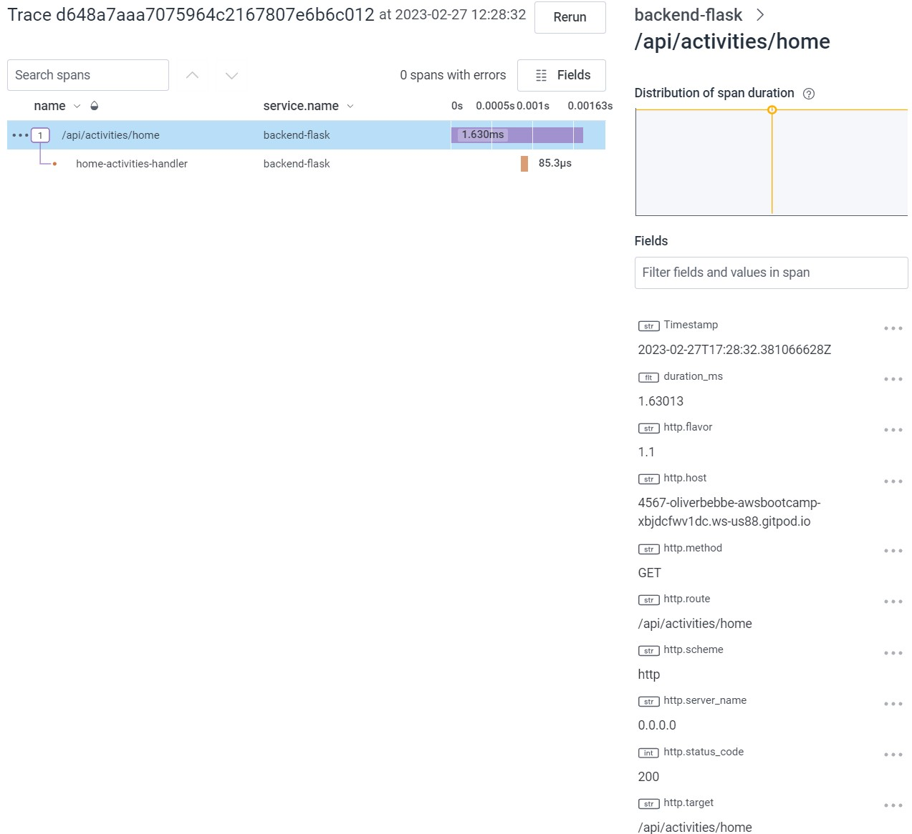

# Week 2 — Distributed Tracing

## Required Homework
- [ ] 
- [ ] 
- [ ] 
- [ ] 
- [ ] 
- [ ] 
- [ ] 
- [ ] 

## Homework Challenges
- [ ] Instrument Honeycomb for the frontend-application to observe network latency between frontend and backend[HARD]
- [ ] Add custom instrumentation to Honeycomb to add more attributes eg. UserId, Add a custom span
- [ ] Run custom queries in Honeycomb and save them later eg. Latency by UserID, Recent Traces

# What is Distributed Tracing?
Distributed tracing is a technique used in software development to help identify and debug problems that occur in complex, distributed systems. In a distributed system, different components of an application can run on different servers, in different programming languages, and may communicate with each other using various communication protocols. It involves instrumenting an application to generate trace data, which provides a detailed view of how requests flow through the different components of a system. 

A trace represents a single request and includes information about the components that were involved in processing the request, the time taken by each component, and any errors that occurred along the way. Tools can be used to collect and visualize trace data, making it easier to understand the performance and behavior of a system as a whole. This can help identify bottlenecks, errors, and other issues that might be impacting the overall performance of the application. 




## What is Instrumenting?
Instrumenting refers to the process of adding code to an application to collect data about its behavior, performance, or usage. The goal of instrumenting an application is to gain insight into how the application is functioning, to identify and fix issues, optimize performance, and improve user experience.

## What is observability?


Observability is a concept in software engineering that refers to the ability to understand the internal state of a system based on its external behavior. Put simply, an observable system can be monitored, analyzed, and understood from the outside.

Observability is essential in modern software development because it allows developers and operators to gain insight into the behavior of complex, distributed systems. 

In a distributed system, different components of an application can run on different servers, in different programming languages, and may communicate with each other using various communication protocols. Observability tools allow developers and operators to track the flow of requests through the system, monitor system health and performance, and identify and troubleshoot issues as they arise.

- Metrics: collect valuable data regarding KPIs like error rates, latency, and throughput. 
- Traces: tracks each request as it occurs and analyzes the performance of each component that processes the requests.
- Logs: capture data from different components of a system and analyze the information to get insights into the an applications behavior.
- Dependencies: reveals how each component is dependent on other components, apps, and IT resources.

Source: https://www.ibm.com/topics/observability & https://newrelic.com/blog/best-practices/observability-instrumentation


# HoneyComb
## Create a HoneyComb account
https://www.honeycomb.io/

I had previously setup my HoneyComb account. If you need an account, go to the website about and click Get Started to begin creating your account.

## Set the API key & Service Name
```sh
export HONEYCOMB_API_KEY=""
export HONEYCOMB_SERVICE_NAME="Cruddur"
gp env HONEYCOMB_API_KEY=""
gp env HONEYCOMB_SERVICE_NAME="Cruddur"
````





NOTE: Instead of calling the HoneyComb Service Name "Cruddur", we will want to name it specifically the name of the service. 
- For example: we will rename this service name to "backend-flask"
- The overall project (Cruddur) should use the same API key, which will allow all services to work together, but each part of the project will have it's own service name.



## Set Env Vars for ```backend-flask``` in ```docker-compose ```
Add the following to the backend-flask service.

```docker
OTEL_EXPORTER_OTLP_ENDPOINT: "https://api.honeycomb.io"
OTEL_EXPORTER_OTLP_HEADERS: "x-honeycomb-team=${HONEYCOMB_API_KEY}"
OTEL_SERVICE_NAME: "backend-flask"
```

## Install Python Packages
```
cd backend-flask
pip install opentelemetry-api
```

Note: running ```pip install opentelemtry-api``` did NOT add to ```requirements.txt```



## Add Dependencies to ```requirements.txt```
```
opentelemetry-api
opentelemetry-sdk
opentelemetry-exporter-otlp-proto-http
opentelemetry-instrumentation-flask
opentelemetry-instrumentation-requests
```

Then run the following from the backend-flask directory

```py
pip install -r requirements.txt
```

## Add ```app.py``` Updates

```py
# HoneyComb Updates -------
from opentelemetry import trace
from opentelemetry.instrumentation.flask import FlaskInstrumentor
from opentelemetry.instrumentation.requests import RequestsInstrumentor
from opentelemetry.exporter.otlp.proto.http.trace_exporter import OTLPSpanExporter
from opentelemetry.sdk.trace import TracerProvider
from opentelemetry.sdk.trace.export import BatchSpanProcessor
```


```py
# HoneyComb Updates -------
# Initialize tracing and an exporter that can send data to Honeycomb
provider = TracerProvider()
processor = BatchSpanProcessor(OTLPSpanExporter())
provider.add_span_processor(processor)
trace.set_tracer_provider(provider)
tracer = trace.get_tracer(__name__)
```

```py
# HoneyComb Updates -------
# Initialize automatic instrumentation with Flask
FlaskInstrumentor().instrument_app(app)
RequestsInstrumentor().instrument()
```

## Add Port Configuration to ```gitpod.yml```
```yml
ports:
  - name: frontend
    port: 3000
    onOpen: open-browser
    visibility: public
  - name: backend
    port: 4567
    visibility: public
  - name: xray-daemon
    port: 2000
    visibility: public
```

## Start Containers
```docker
docker compose up
```

## Add SimpleSpanProcessor (ConsoleSpanExporter) to ```app.py```
Under the first section for HoneyComb Updates:
```py
from opentelemetry.sdk.trace.export import ConsoleSpanExporter, SimpleSpanProcessor
```

Add this to the second section of HoneyComb Updates (Initialize tracing & an exporter that can send data to Honeycomb)
```py
# Show this in logs within backend-flask app (STDOUT)
simple_processor = SimpleSpanProcessor(ConsoleSpanExporter())
provider.add_simple_span_processor(simple_processor)
```

### Check HoneyComb for Data
Click on Home & Spans should be displayed





## Create a New Span in ```home_activities.py```
```py
from opentelemetry import trace

tracer = trace.get_tracer("tracer.name.here")
```

NOTE: Rename 'trace.name.here' replace it with 'home.activities'
- It's best practice to name it after the module/service it is being used for.


Add the following under def run within ```home_activities.py```

```py
with tracer.start_as_current_span("http-handler"):
```

NOTE: Rename 'http-handler' to name the span.

Found code to add from: https://docs.honeycomb.io/getting-data-in/opentelemetry/python/





# Homework Challenges
## Instrument Honeycomb for the frontend-application to observe network latency between frontend and backend[HARD]

## Add custom instrumentation to Honeycomb to add more attributes eg. UserId, Add a custom span
Resource: https://docs.honeycomb.io/getting-data-in/opentelemetry/python/


## Run custom queries in Honeycomb and save them later eg. Latency by UserID, Recent Traces
Resource: https://docs.honeycomb.io/working-with-your-data/queries/

## About Queries
Queries in HoneyComb consist of 6 clauses:
- Visualize: Visualize specific stats across events
- Where: Choose events based on additional criteria.
- Group By: Split events into groups based on the value of a specified attribute.
- Order By: Sort the results.
- Limit: Specify a limit on the number of results to return.
- Having: Filter results based on aggregate criteria.

Most queries output defaults to a time series and a summary table. Precise composition will depend on the composition of the queries you create:
    
- Specifying a visualize clause will cause a time series to be drawn representing the calculated value over time. 
    - Multiple visualize clauses wil result in multiple graphs, one for each calculation.
- Specifying a group by clause will result in the time series drawing multiple lines, one for each group.
    - The summary table will contain a single row for each unique group.
- Leaving visualize blank will result in raw event data being returned without any summarization.