# Week 2 — Distributed Tracing

## Required Homework
- [x] Watch <Live href="https://www.youtube.com/watch?v=2GD9xCzRId4&list=PLBfufR7vyJJ7k25byhRXJldB5AiwgNnWv&index=30">Live Stream Video</a>
- [x] Watch Chirag's Week 2 - Spending Considerations
- [x] Watch Ashish's Week 2 - <a href="https://www.youtube.com/watch?v=bOf4ITxAcXc&list=PLBfufR7vyJJ7k25byhRXJldB5AiwgNnWv&index=32">Observability Security Considerations</a>
- [x] Instrument Honeycomb with OTEL
- [x] <a href="https://www.youtube.com/watch?v=n2DTsuBrD_A&list=PLBfufR7vyJJ7k25byhRXJldB5AiwgNnWv&index=32">Instrument AWS X-Ray</a>
- [x] Configure custom logger to send to CloudWatch Logs
- [x] Integrate Rollbar and capture errors

## Homework Challenges
- [ ] Instrument Honeycomb for the frontend-application to observe network latency between frontend and backend[HARD]
- [ ] Add custom instrumentation to Honeycomb to add more attributes eg. UserId, Add a custom span
- [x] Run custom queries in Honeycomb and save them later eg. Latency by UserID, Recent Traces

# What is Distributed Tracing?
Distributed tracing is a technique used in software development to help identify and debug problems that occur in complex, distributed systems. In a distributed system, different components of an application can run on different servers, in different programming languages, and may communicate with each other using various communication protocols. It involves instrumenting an application to generate trace data, which provides a detailed view of how requests flow through the different components of a system. 

A trace represents a single request and includes information about the components that were involved in processing the request, the time taken by each component, and any errors that occurred along the way. Tools can be used to collect and visualize trace data, making it easier to understand the performance and behavior of a system as a whole. This can help identify bottlenecks, errors, and other issues that might be impacting the overall performance of the application. 


## What is Instrumentation?
Instrumenting refers to the process of adding code to an application to collect data about its behavior, performance, or usage. The goal of instrumenting an application is to gain insight into how the application is functioning, to identify and fix issues, optimize performance, and improve user experience.

Put simply, instrumentation helps produce logs or traces.

## What is observability?


Observability is a concept in software engineering that refers to the ability to understand the internal state of a system based on its external behavior. Put simply, an observable system can be monitored, analyzed, and understood from the outside.

Observability is essential in modern software development because it allows developers and operators to gain insight into the behavior of complex, distributed systems. 

In a distributed system, different components of an application can run on different servers, in different programming languages, and may communicate with each other using various communication protocols. Observability tools allow developers and operators to track the flow of requests through the system, monitor system health and performance, and identify and troubleshoot issues as they arise.

- Metrics: collect valuable data regarding KPIs like error rates, latency, and throughput. 
    - For instance, metrics for downtime can be created.
- Traces: tracks each request as it occurs and analyzes the performance of each component that processes the requests.
    - Tracing will help map out the root problem.
- Logs: capture data from different components of a system and analyze the information to get insights into the an applications behavior.
    - Every application is producing logs.
    - Metrics can be used on top of this.
- Dependencies: reveals how each component is dependent on other components, apps, and IT resources.

Source: https://www.ibm.com/topics/observability & https://newrelic.com/blog/best-practices/observability-instrumentation

- Decreased Alert Fatigue for Security Operation Teams
- Visibility of end-to-end logs, metrics, & tracing
- Troubleshooting & resolve things without increased expenses
- Understand application health
- Accelerate collaboration between teams
- Reduce overall operational costs
- Increase customer satisfaction

Observability covers the entire lifecycle of an application.

## What is Monitoring?
Monitoring typically refers to collecting and analyzing data from a system or application to determine its health and performance, including metrics such as CPU usage, memory usage, network traffic, and error rates, among other things. Monitoring focuses on providing real-time feedback on the state of a system so that teams can quickly identify and respond to issues as they arise.

## Observability vs Monitoring
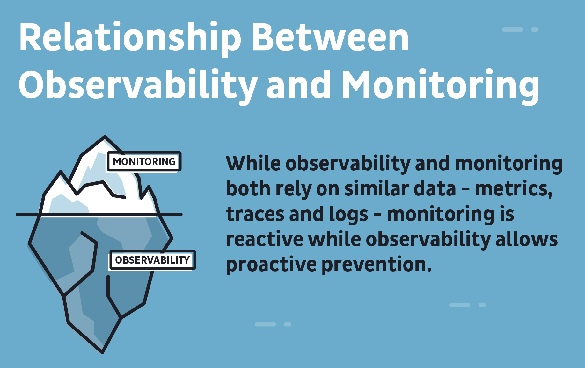


## AWS Observability Services
- AWS CloudWatch Logs
- AWS CloudWatch Metrics
- AWS X-Ray Traces

## Security Considerations
- CloudTrail
- CloudWatch Agent
- CloudWatch Metrics
- X-Rays Traces
- AWS Private CA
- AWS Certificate Manager
- AWS Backup
- Amazon Inspector
- AWS KMS
- AWS ECS Cluster auto-scaling

## Building Security Metrics & Logs for Tracing
1. Which application?
2. Type of application (compute, monolith, microservices)
3. Threat modelling session
4. Identity Attack Vectors
5. Map Attack Vectors to TTP in MITRE ATT&CK Framework
6. Identify instrumentation agents to create tracing
7. AWS services such as AWS Distro for OpenTelemetry (ADOT) for metrics & traces
8. Dashboards for Practical Attack Vectors only for the application
9. Repeat steps for other applications


Central Observability Platforms
- AWS Security Hub with Amazon EventBridge
- SIEM
- Open Source Dashboards
- Event Drive Architecture with AWS Services

## Event Driven Security
- Event Drive Architecture using serverless
- Auto remediation with Amazon EventBridge & AWS Security Hub
- AWS Services for Threat Detection (Amazon GuardDuty or third-party services)


# HoneyComb
## Create a HoneyComb account
https://www.honeycomb.io/

I had previously setup my HoneyComb account. If you need an account, go to the website about and click Get Started to begin creating your account.

## Set the API key & Service Name
```sh
export HONEYCOMB_API_KEY=""
export HONEYCOMB_SERVICE_NAME="Cruddur"
gp env HONEYCOMB_API_KEY=""
gp env HONEYCOMB_SERVICE_NAME="Cruddur"
````


NOTE: Instead of calling the HoneyComb Service Name "Cruddur", we will want to name it specifically the name of the service. 
- For example: we will rename this service name to "backend-flask"
- The overall project (Cruddur) should use the same API key, which will allow all services to work together, but each part of the project will have it's own service name.


## Set Env Vars for ```backend-flask``` in ```docker-compose ```
Add the following to the backend-flask service.

```docker
OTEL_EXPORTER_OTLP_ENDPOINT: "https://api.honeycomb.io"
OTEL_EXPORTER_OTLP_HEADERS: "x-honeycomb-team=${HONEYCOMB_API_KEY}"
OTEL_SERVICE_NAME: "backend-flask"
```

## Install Python Packages
```
cd backend-flask
pip install opentelemetry-api
```

Note: running ```pip install opentelemtry-api``` did NOT add to ```requirements.txt```


## Add Dependencies to ```requirements.txt```
```
opentelemetry-api
opentelemetry-sdk
opentelemetry-exporter-otlp-proto-http
opentelemetry-instrumentation-flask
opentelemetry-instrumentation-requests
```

Then run the following from the backend-flask directory

```py
pip install -r requirements.txt
```

## Add ```app.py``` Updates

```py
# HoneyComb Updates -------
from opentelemetry import trace
from opentelemetry.instrumentation.flask import FlaskInstrumentor
from opentelemetry.instrumentation.requests import RequestsInstrumentor
from opentelemetry.exporter.otlp.proto.http.trace_exporter import OTLPSpanExporter
from opentelemetry.sdk.trace import TracerProvider
from opentelemetry.sdk.trace.export import BatchSpanProcessor
```


```py
# HoneyComb Updates -------
# Initialize tracing and an exporter that can send data to Honeycomb
provider = TracerProvider()
processor = BatchSpanProcessor(OTLPSpanExporter())
provider.add_span_processor(processor)
trace.set_tracer_provider(provider)
tracer = trace.get_tracer(__name__)
```

```py
# HoneyComb Updates -------
# Initialize automatic instrumentation with Flask
FlaskInstrumentor().instrument_app(app)
RequestsInstrumentor().instrument()
```

## Add Port Configuration to ```gitpod.yml```
```yml
ports:
  - name: frontend
    port: 3000
    onOpen: open-browser
    visibility: public
  - name: backend
    port: 4567
    visibility: public
  - name: xray-daemon
    port: 2000
    visibility: public
```

## Start Containers
```docker
docker compose up
```

## Add SimpleSpanProcessor (ConsoleSpanExporter) to ```app.py```
Under the first section for HoneyComb Updates:
```py
from opentelemetry.sdk.trace.export import ConsoleSpanExporter, SimpleSpanProcessor
```

Add this to the second section of HoneyComb Updates (Initialize tracing & an exporter that can send data to Honeycomb)
```py
# Show this in logs within backend-flask app (STDOUT)
simple_processor = SimpleSpanProcessor(ConsoleSpanExporter())
provider.add_simple_span_processor(simple_processor)
```

### Check HoneyComb for Data
Click on Home & Spans should be displayed


## Create a New Span in ```home_activities.py```
```py
from opentelemetry import trace

tracer = trace.get_tracer("tracer.name.here")
```

NOTE: Rename 'trace.name.here' replace it with 'home.activities'
- It's best practice to name it after the module/service it is being used for.


Add the following under def run within ```home_activities.py```

```py
with tracer.start_as_current_span("http-handler"):
```

NOTE: Rename 'http-handler' to name the span.

Found code to add from: https://docs.honeycomb.io/getting-data-in/opentelemetry/python/


# AWS X-ray
## Add & Install Dependencies
Add the following to ```requirements.txt```

```py
aws-xray-sdk
```

Change directories to backend-flask then install dependencies:

```
cd backend-flask
pip install -r requirements.txt
```


## Add to ```app.py```
```py
from aws_xray_sdk.core import xray_recorder
from aws_xray_sdk.ext.flask.middleware import XRayMiddleware

xray_url = os.getenv("AWS_XRAY_URL")
xray_recorder.configure(service='backend-flask', dynamic_naming=xray_url)
XRayMiddleware(app, xray_recorder)
```
## Add `aws/json/xray.json`

```json
{
  "SamplingRule": {
      "RuleName": "Cruddur",
      "ResourceARN": "*",
      "Priority": 9000,
      "FixedRate": 0.1,
      "ReservoirSize": 5,
      "ServiceName": "backend-flask",
      "ServiceType": "*",
      "Host": "*",
      "HTTPMethod": "*",
      "URLPath": "*",
      "Version": 1
  }
}
```

## Create a Group to Create X-ray Trace
Run the following from within ```backend-flask```

```sh
FLASK_ADDRESS="https://4567-${GITPOD_WORKSPACE_ID}.${GITPOD_WORKSPACE_CLUSTER_HOST}"
aws xray create-group \
   --group-name "Cruddur" \
   --filter-expression "service(\"backend-flask\")"
```

- I ran into an issue while trying to create a group for X-ray traces due to leaving off an additional " at the end of the command.

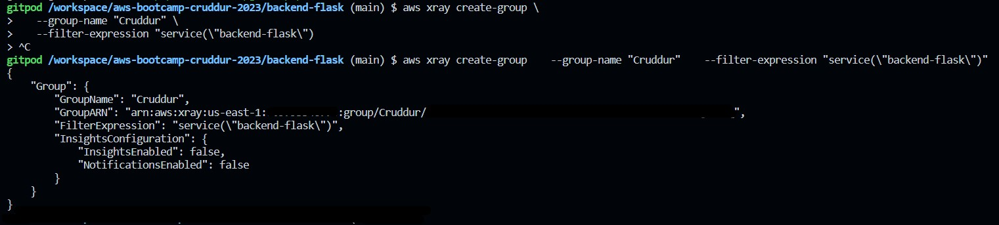

Successfully created and located the group within CloudWatch X-ray Traces.

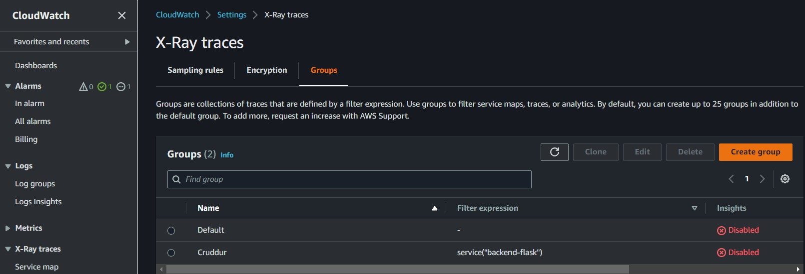

## Create a Sampling Rule
Sampling will allow you to determine what information you will see.
- This can help reduce spend.

Run the following from the terminal:

```sh
cd ..
aws xray create-sampling-rule --cli-input-json file://aws/json/xray.json
```

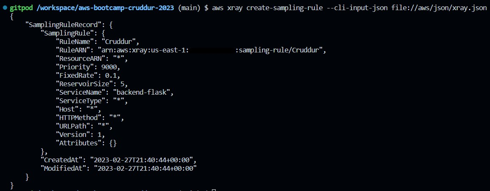

## Add Daemon Service to ```docker-compose.yml```

```yml
  xray-daemon:
    image: "amazon/aws-xray-daemon"
    environment:
      AWS_ACCESS_KEY_ID: "${AWS_ACCESS_KEY_ID}"
      AWS_SECRET_ACCESS_KEY: "${AWS_SECRET_ACCESS_KEY}"
      AWS_REGION: "us-east-1"
    command:
      - "xray -o -b xray-daemon:2000"
    ports:
      - 2000:2000/udp
```

We need to add these two env vars to our backend-flask in our `docker-compose.yml` file

```yml
      AWS_XRAY_URL: "*4567-${GITPOD_WORKSPACE_ID}.${GITPOD_WORKSPACE_CLUSTER_HOST}*"
      AWS_XRAY_DAEMON_ADDRESS: "xray-daemon:2000"
```

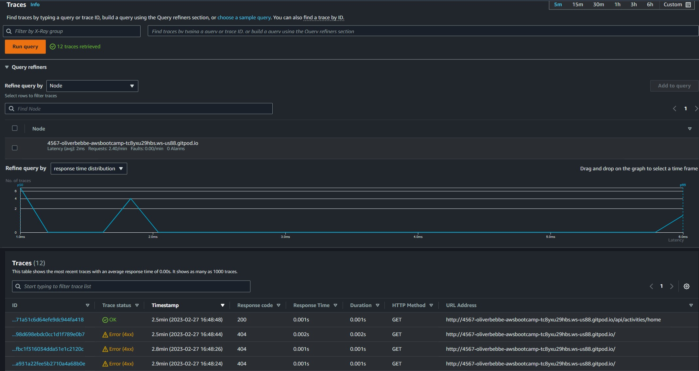

To search for the traces after adding a segment & subsegment to ```user_activities.py```, I was unsuccessful to locate them until commenting out the segment & subsegment sections we added to the file in the video. Once commenting it out, I used the following query and had success:

http.url CONTAINS "/api/activities/@andrewbrown"

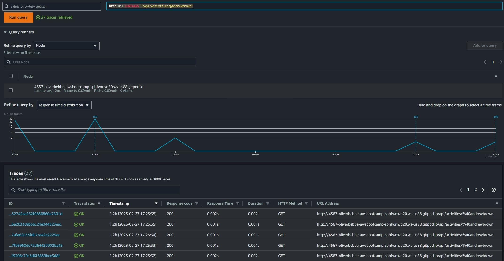


# Custom CloudWatch Logs
Add the following to `requirements.txt`

```
watchtower
```

Then do the following:

```sh
cd backend-flask
pip install -r requirements.txt
```

## Add dependencies to `app.py`
```py
# CloudWatch Logs -------
import watchtower
import logging
from time import strftime
```

## Configure Logger for CloudWatch in `app.py`
```py
# Configuring Logger to Use CloudWatch -------
LOGGER = logging.getLogger(__name__)
LOGGER.setLevel(logging.DEBUG)
console_handler = logging.StreamHandler()
cw_handler = watchtower.CloudWatchLogHandler(log_group='cruddur')
LOGGER.addHandler(console_handler)
LOGGER.addHandler(cw_handler)
# LOGGER.info("some message")
```

## Configure error logging in `app.py`
```py
@app.after_request
def after_request(response):
    timestamp = strftime('[%Y-%b-%d %H:%M]')
    LOGGER.error('%s %s %s %s %s %s', timestamp, request.remote_addr, request.method, request.scheme, request.full_path, response.status)
    return response
```

## Set Env Vars for CloudWatch

```yml
      AWS_DEFAULT_REGION: "${AWS_DEFAULT_REGION}"
      AWS_ACCESS_KEY_ID: "${AWS_ACCESS_KEY_ID}"
      AWS_SECRET_ACCESS_KEY: "${AWS_SECRET_ACCESS_KEY}"
```

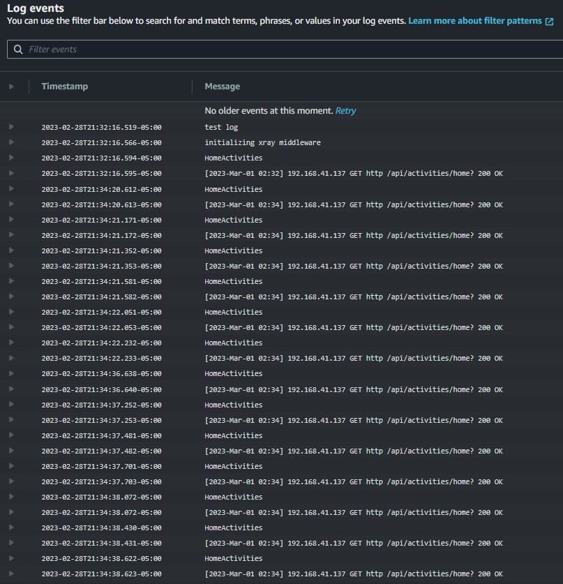


# Rollbar
https://rollbar.com

Create a new project in Rollbar called `Cruddur`

## Add to `requirements.txt`

```
blinker
rollbar
```

## Install dependencies
```sh
cd backend-flask
pip install -r requirements.txt
```

## Set Access Token
```sh
export ROLLBAR_ACCESS_TOKEN=""
gp env ROLLBAR_ACCESS_TOKEN=""
```

## Add token to backend-flask in `docker-compose.yml`
```yml
ROLLBAR_ACCESS_TOKEN: "${ROLLBAR_ACCESS_TOKEN}"
```
## Import Rollbar in `app.py`
```py
# Rollbar -----
import rollbar
import rollbar.contrib.flask
from flask import got_request_exception
```

```py
# Rollbar -----
rollbar_access_token = os.getenv('ROLLBAR_ACCESS_TOKEN')
@app.before_first_request
def init_rollbar():
    """init rollbar module"""
    rollbar.init(
        # access token
        rollbar_access_token,
        # environment name
        'production',
        # server root directory, makes tracebacks prettier
        root=os.path.dirname(os.path.realpath(__file__)),
        # flask already sets up logging
        allow_logging_basic_config=False)
    # send exceptions from `app` to rollbar, using flask's signal system.
    got_request_exception.connect(rollbar.contrib.flask.report_exception, app)
```

## Add an endpoint just for testing rollbar to `app.py`
```py
# Rollbar -----
@app.route('/rollbar/test')
def rollbar_test():
    rollbar.report_message('Hello World!', 'warning')
    return "Hello World!"
```

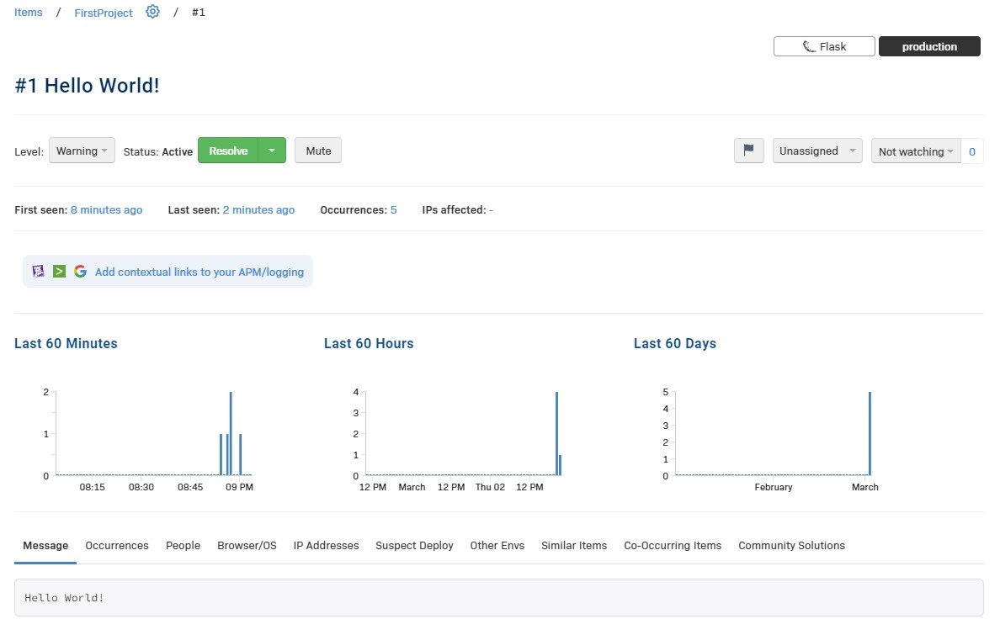


# Homework Challenges
# Instrument Honeycomb for the frontend-application to observe network latency between frontend and backend[HARD]
Resource: https://docs.honeycomb.io/getting-data-in/opentelemetry/browser-js/

## <center> *** this needs further research ***</center>

## Set the Service Name
```sh
export HONEYCOMB_API_KEY=""
export HONEYCOMB_SERVICE_NAME="frontend-react-js"
gp env HONEYCOMB_API_KEY=""
gp env HONEYCOMB_SERVICE_NAME="frontend-react-js"
```

Note: I'm unsure if this is going to work as my API key and Env Var for backend-flask are now replaced with the API Key and Env Var for frontend-react-js.

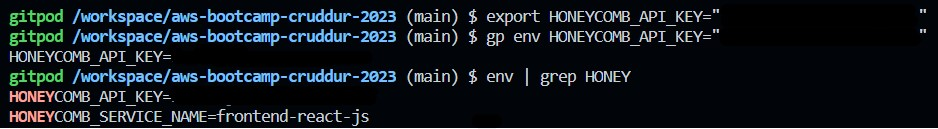


## Set Env Vars for ```frontend-react-js``` in ```docker-compose ```
Add the following to the backend-flask service.

```docker
OTEL_EXPORTER_OTLP_ENDPOINT: "https://api.honeycomb.io"
OTEL_EXPORTER_OTLP_HEADERS: "x-honeycomb-team=${HONEYCOMB_API_KEY}"
OTEL_SERVICE_NAME: "frontend-react-js"
```

## Instrumentation Packages
Add the following to ```package-lock.json```

```sh
# not sure if the npm install --save is needed
# npm install --save
@opentelemetry/api
@opentelemetry/sdk-trace-web
@opentelemetry/exporter-trace-otlp-http
@opentelemetry/context-zone
```


## Create Initialization File
```js
// tracing.js
import { OTLPTraceExporter } from '@opentelemetry/exporter-trace-otlp-http';
import { WebTracerProvider, BatchSpanProcessor } from '@opentelemetry/sdk-trace-web';
import { ZoneContextManager } from '@opentelemetry/context-zone';
import { Resource }  from '@opentelemetry/resources';
import { SemanticResourceAttributes } from '@opentelemetry/semantic-conventions';

const exporter = new OTLPTraceExporter({
  url: 'https://<your collector endpoint>:443/v1/traces'
});
const provider = new WebTracerProvider({
  resource: new Resource({
    [SemanticResourceAttributes.SERVICE_NAME]: 'browser',
  }),
});
provider.addSpanProcessor(new BatchSpanProcessor(exporter));
provider.register({
  contextManager: new ZoneContextManager()
});
```


```js
// index.js
import './tracing.js'

// ...rest of the app's entry point code
```

# Add custom instrumentation to Honeycomb to add more attributes eg. UserId, Add a custom span
Resource: https://docs.honeycomb.io/getting-data-in/opentelemetry/python/


# Run custom queries in Honeycomb and save them later eg. Latency by UserID, Recent Traces
Resource: https://docs.honeycomb.io/working-with-your-data/queries/

## About Queries
Queries in HoneyComb consist of 6 clauses:
- Visualize: Visualize specific stats across events
- Where: Choose events based on additional criteria.
- Group By: Split events into groups based on the value of a specified attribute.
- Order By: Sort the results.
- Limit: Specify a limit on the number of results to return.
- Having: Filter results based on aggregate criteria.

Most queries output defaults to a time series and a summary table. Precise composition will depend on the composition of the queries you create:
    
- Specifying a visualize clause will cause a time series to be drawn representing the calculated value over time. 
    - Multiple visualize clauses wil result in multiple graphs, one for each calculation.
- Specifying a group by clause will result in the time series drawing multiple lines, one for each group.
    - The summary table will contain a single row for each unique group.
- Leaving visualize blank will result in raw event data being returned without any summarization.

## Create a New Query
I created 2 new queries to save for later.
1. Based on status codes not equal to 200.
2. Based on the backend-flask service name where the trace.parent_id doesn't exist, grouping by user agent and displayed in descending order.


From within HoneyComb, click on New Query.

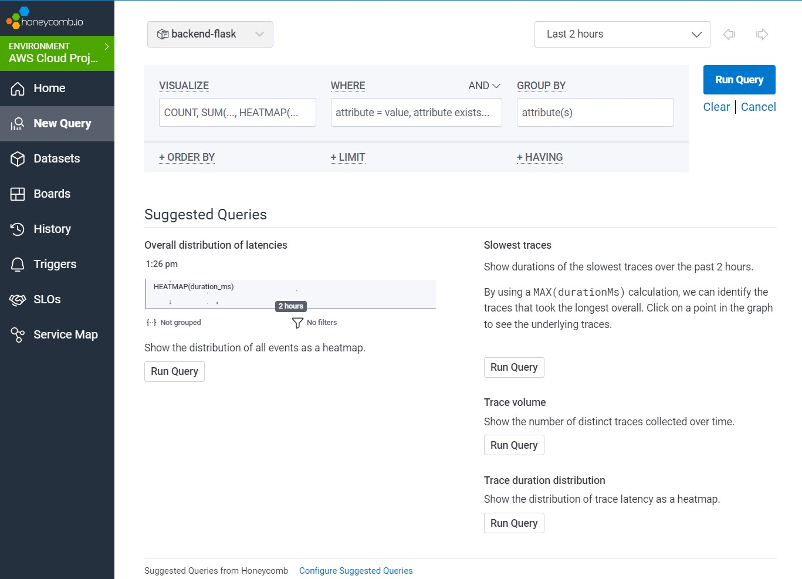

- Select the desired Visualize option
- Select the desired Where option
- Select the desired Group By option

Then click Run Query

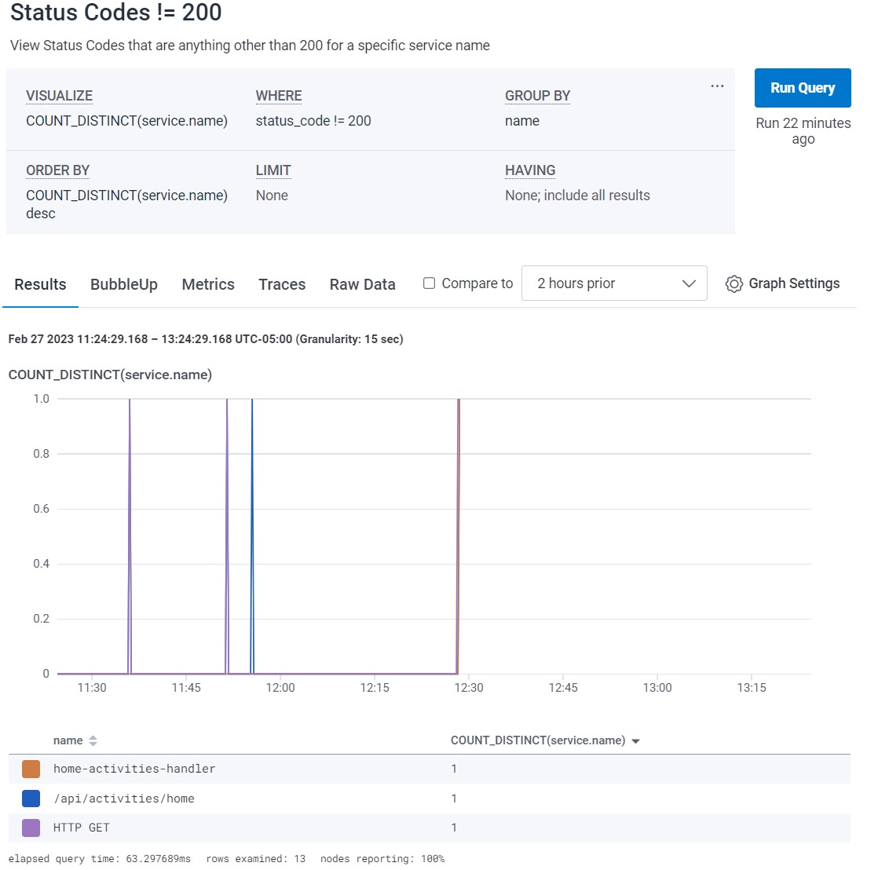

I created an addition query using the Heatmap Visualize option:

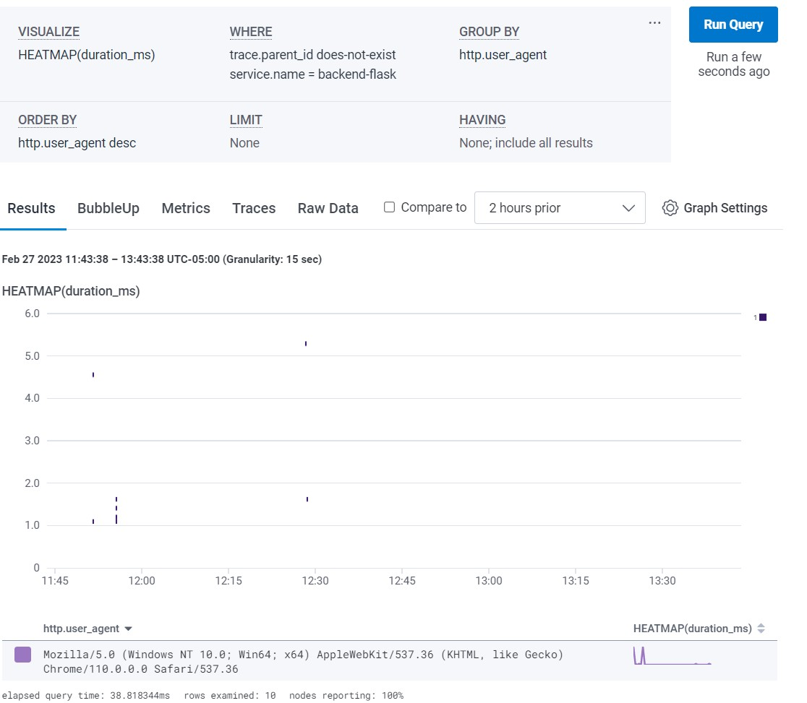

To find these queries again to run, you can click on the History tab on the left side of the screen.

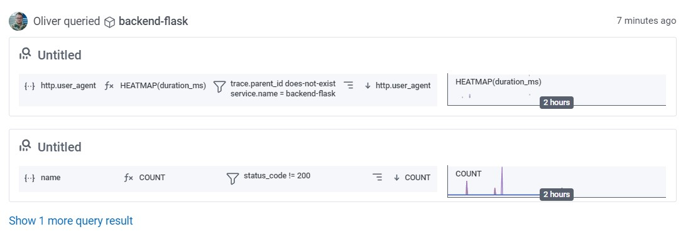


# Homework Summary
What did I accomplish?
- All required homework assignments and some homework challenges.

Were there any obstacles (did I overcome them)?
- Only issue I faced was when I attempted the HW Challenge - Instrument Honeycomb for the frontend to observe network latency between front and backend.

What were the homework challenges I attempted?
- Instrument Honeycomb for the frontend to observe network latency between front and backend; I tried to follow similar steps as instrumenting the backend, however when I set the API key, it set it for the entire environment (like Jess had mentioned it would in the live stream), and when I tried setting the HONEYCOMB_SERVICE_NAME="frontend-react-js" it replaced my backend-flask service name.
- Run custom queries in Honeycomb and save them for later; I researched queries and their options using Honeycomb's docs and created 2 queries. One to search for all status codes not equal to 200, and one as an experiment to see what different options would return.