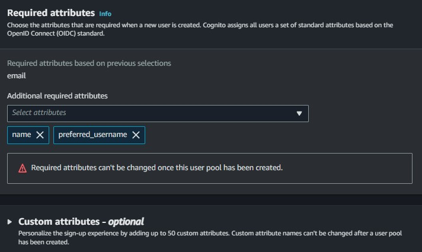
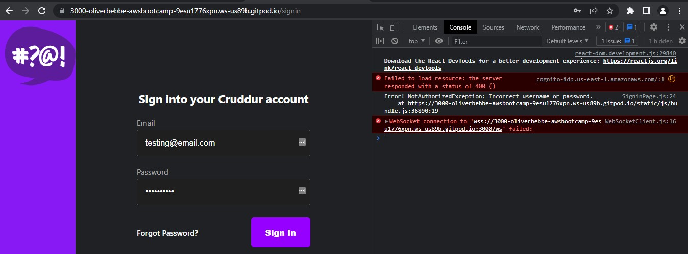

# Week 3 — Decentralized Authentication

## Homework
- [x] Ashish's Week 3 - <a href="https://www.youtube.com/watch?v=tEJIeII66pY&list=PLBfufR7vyJJ7k25byhRXJldB5AiwgNnWv&index=39">Decentralized Authentication</a> 
- [ ] Chirag's Week 3 - Spending Considerations
- [x] Setup Cognito User Pool
- [x] Implement Custom Sign-in Page
- [ ] Implement Custom Sign-up Page
- [ ] Implement Custom Confirmation Page
- [ ] Implement Custom Recovery Page
- [ ] Watch about different approaches to verifying JWTs

## Homework Challenges
- [ ] Decouple the JWT verify from the application code by writing a Flask Middleware (medium)
- [ ] Decouple the JWT verify by implementing a Container Sidecar pattern using the official AWS aws-jwt-verify.js library (hard)
- [ ] Decouple the JWT verify process by using Envoy as a sidecar (hard)
  - https://www.envoyproxy.io/
- [ ] Implement an IdP login (Amazon, Facebook, Apple, or Google) (hard)
- [ ] Implement MFA that sends SMS (not, this has spend, investigate spend before considering, text messages are not eligible for AWS credits) (easy)
- [ ] Research how to create users with Cognito without temp password 
  - https://stackoverflow.com/questions/64720348/create-new-users-in-aws-cognito-without-a-temp-password-email
  - https://stackoverflow.com/questions/45666794/aws-cognito-user-pool-without-a-password
- [ ] Configure the confirmation page to automatically log the new user into their account
- [ ] Research how to restrict users from resetting their password to a previously used password
- [ ] Fix successful recovery page


# Setup AWS Cognito
## Create new user pool
- User pools to have login and sign up
- Federated identity providers would use a social identity from another identity provider

NOTE: Required attributes cannot be changed after creating the user pool.

- Log into the AWS Console
- Search for Cognito
- Click on Create user pool


Since we're not using Federated identity providers, we will use the Cognito user pool.

- Select User name and email for sign-in options
- Allow users to sign in with a preferred user name


- We're selecting a custom password for the security requirements as the default isn't extremely secure. I believe the default was set to 8 characters for the password length.
- After selecting Custom, enter in the minimum password length you want for your users to be required to use.


- To make sure we don't have additional expenses, we are skipping MFA.


- To make sure we don't have additional expenses, we will use email only for account recovery messages.
    - SMS incurs additional costs.


- We want to allow our users to have a self-service sign up page


- We want to allow Cognito to automatically send messages to verify & confirm. 
  - Attributes to verify: select Send email message, verify email address
- Verifying attribute changes: select Keep original attribute value active when an update is pending - Recommended
- Active attribute values when an update is pending: select Email address



- Required Attributes: 
  - Email
  - name
  - preferred_username


- Configure message delivery: Send email with Cognito


- Name the user pool


- App type: Public client
- Name the app client
- Client secret: Don't generate a client secret


## Install AWS Amplify Library
AWS Amplify will allow us to use Cognito

Documentation: https://docs.amplify.aws/lib/auth/getting-started/q/platform/js/

```sh
cd frontend-react-js
npm i aws-amplify --save
```

Adding this as a dependency.
Open `package.json` and we should see `"aws-amplify: ^5.0.16"`

## Provision Cognito User Group
Using the AWS Console we'll create a Cognito User Group

## Configure Amplify
We need to hook up our cognito pool to our code in the `App.js`

```js
import { Amplify } from 'aws-amplify';

Amplify.configure({
  "AWS_PROJECT_REGION": process.env.REACT_APP_AWS_PROJECT_REGION,
  "aws_cognito_identity_pool_id": process.env.REACT_APP_AWS_COGNITO_IDENTITY_POOL_ID,
  "aws_cognito_region": process.env.REACT_APP_AWS_COGNITO_REGION,
  "aws_user_pools_id": process.env.REACT_APP_AWS_USER_POOLS_ID,
  "aws_user_pools_web_client_id": process.env.REACT_APP_CLIENT_ID,
  "oauth": {},
  Auth: {
    // We are not using an Identity Pool
    // identityPoolId: process.env.REACT_APP_IDENTITY_POOL_ID, // REQUIRED - Amazon Cognito Identity Pool ID
    region: process.env.REACT_APP_AWS_PROJECT_REGION,           // REQUIRED - Amazon Cognito Region
    userPoolId: process.env.REACT_APP_AWS_USER_POOLS_ID,         // OPTIONAL - Amazon Cognito User Pool ID
    userPoolWebClientId: process.env.REACT_APP_AWS_USER_POOLS_WEB_CLIENT_ID,   // OPTIONAL - Amazon Cognito Web Client ID (26-char alphanumeric string)
  }
});
```
Edited above Auth region to be 

```js
process.env.REACT_APP_AWS_PROJECT_REGION
```

# Conditionally show components based on logged in or logged out
Inside our `HomeFeedPage.js`

```js
import { Auth } from 'aws-amplify';
```


```js
// set a state
const [user, setUser] = React.useState(null);
```
^^ already in HomeFeedPage.js


Replace the checkAuth in HomeFeedPage.js (41-50)
```js
// check if we are authenticated
const checkAuth = async () => {
  Auth.currentAuthenticatedUser({
    // Optional, By default is false. 
    // If set to true, this call will send a 
    // request to Cognito to get the latest user data
    bypassCache: false 
  })
  .then((user) => {
    console.log('user',user);
    return Auth.currentAuthenticatedUser()
  }).then((cognito_user) => {
      setUser({
        display_name: cognito_user.attributes.name,
        handle: cognito_user.attributes.preferred_username
      })
  })
  .catch((err) => console.log(err));
};
```


```js
// check when the page loads if we are authenticated
React.useEffect(()=>{
  loadData();
  checkAuth();
}, [])
```
^^ already in HomeFeedPage.js


## Pass user to the following components:

```js
<DesktopNavigation user={user} active={'home'} setPopped={setPopped} />
<DesktopSidebar user={user} />
```

We'll rewrite `DesktopNavigation.js` so that it it conditionally shows links in the left hand column
on whether you are logged in or not.

Notice we are passing the user to ProfileInfo

```js
import './DesktopNavigation.css';
import {ReactComponent as Logo} from './svg/logo.svg';
import DesktopNavigationLink from '../components/DesktopNavigationLink';
import CrudButton from '../components/CrudButton';
import ProfileInfo from '../components/ProfileInfo';
export default function DesktopNavigation(props) {
  let button;
  let profile;
  let notificationsLink;
  let messagesLink;
  let profileLink;
  if (props.user) {
    button = <CrudButton setPopped={props.setPopped} />;
    profile = <ProfileInfo user={props.user} />;
    notificationsLink = <DesktopNavigationLink 
      url="/notifications" 
      name="Notifications" 
      handle="notifications" 
      active={props.active} />;
    messagesLink = <DesktopNavigationLink 
      url="/messages"
      name="Messages"
      handle="messages" 
      active={props.active} />
    profileLink = <DesktopNavigationLink 
      url="/@andrewbrown" 
      name="Profile"
      handle="profile"
      active={props.active} />
  }
  return (
    <nav>
      <Logo className='logo' />
      <DesktopNavigationLink url="/" 
        name="Home"
        handle="home"
        active={props.active} />
      {notificationsLink}
      {messagesLink}
      {profileLink}
      <DesktopNavigationLink url="/#" 
        name="More" 
        handle="more"
        active={props.active} />
      {button}
      {profile}
    </nav>
  );
}
```

## Update `ProfileInfo.js`
Replace 
```js
import Cookies from 'js-cookie'
```

With the following:

```js
import { Auth } from 'aws-amplify';
```

Replace 
```js
  const signOut = async () => {
    console.log('signOut')
    // [TODO] Authenication
    Cookies.remove('user.logged_in')
    //Cookies.remove('user.name')
    //Cookies.remove('user.username')
    //Cookies.remove('user.email')
    //Cookies.remove('user.password')
    //Cookies.remove('user.confirmation_code')
    window.location.href = "/"
  }
```

With the following:

```js
const signOut = async () => {
  try {
      await Auth.signOut({ global: true });
      window.location.href = "/"
  } catch (error) {
      console.log('error signing out: ', error);
  }
}
```

We'll rewrite `DesktopSidebar.js` so that it conditionally shows components in case you are logged in or not.

```js
import './DesktopSidebar.css';
import Search from '../components/Search';
import TrendingSection from '../components/TrendingsSection'
import SuggestedUsersSection from '../components/SuggestedUsersSection'
import JoinSection from '../components/JoinSection'
export default function DesktopSidebar(props) {
  const trendings = [
    {"hashtag": "100DaysOfCloud", "count": 2053 },
    {"hashtag": "CloudProject", "count": 8253 },
    {"hashtag": "AWS", "count": 9053 },
    {"hashtag": "FreeWillyReboot", "count": 7753 }
  ]
  const users = [
    {"display_name": "Andrew Brown", "handle": "andrewbrown"}
  ]
  let trending;
  if (props.user) {
    trending = <TrendingSection trendings={trendings} />
  }
  let suggested;
  if (props.user) {
    suggested = <SuggestedUsersSection users={users} />
  }
  let join;
  if (props.user) {
  } else {
    join = <JoinSection />
  }
  return (
    <section>
      <Search />
      {trending}
      {suggested}
      {join}
      <footer>
        <a href="#">About</a>
        <a href="#">Terms of Service</a>
        <a href="#">Privacy Policy</a>
      </footer>
    </section>
  );
}
```

Tested app and the frontend resulted in a blank page.


Made changes to `App.js` auth region
```js
process.env.REACT_APP_AWS_PROJECT_REGION
```
# Sign-in Page
Replace ```import Cookies from 'js-cookie'``` with the following:

```js
import { Auth } from 'aws-amplify';
```

```js
const [cognitoErrors, setCognitoErrors] = React.useState('');

const onsubmit = async (event) => {
  setErrors('')
  event.preventDefault();
  try {
    Auth.signIn(email, password)
      .then(user => {
        localStorage.setItem("access_token", user.signInUserSession.accessToken.jwtToken)
        window.location.href = "/"
      })
      .catch(err => { console.log('Error!', err) });
  } catch (error) {
    if (error.code == 'UserNotConfirmedException') {
      window.location.href = "/confirm"
    }
    setErrors(error.message)
  }
  return false
}

let errors;
if (cognitoErrors){
  errors = <div className='errors'>{cognitoErrors}</div>;
}
// just before submit component
{errors}
```



Upon testing the sign-in page, no error displayed publicly. Edited the code to be what's shown below and the error displayed!

```js
  const onsubmit = async (event) => {
    setErrors('')
    event.preventDefault();
    Auth.signIn(email, password)
    .then(user => {
      localStorage.setItem("access_token", user.signInUserSession.accessToken.jwtToken)
      window.location.href = "/"
    })
    .catch(error => {
      if (error.code == 'UserNotConfirmedException') {
        window.location.href = "/confirm"
      }
      setErrors(error.message)
    });
    return false
  }
```


# Create User in AWS Cognito

- Go into AWS Cognito User pools
- Open the User pool we created from earlier


- Click Create user
- Select the Email checkbox
- Create a username
- Enter a valid email
- Set a password


- Click Create user


- Could not confirm user within AWS Cognito.
- Attempting to sign in with the newly created user account resulted in the following error


After reviewing the steps taken while creating a user in Cognito, I noticed we didn't select "Send an email invitation". This may be why we couldn't confirm the user account, and why no email was received after creating the account.


Recreated user with the checkbox selected and the email arrived in my inbox shortly after.
- The email that was received, however, presents a security issue. I will be adding this into my homework challenges to see how I can make this more secure.

After recreating the user in Cognito, the same error message appeared.

The line below appears to be part of the problem (in `app.js`)

```js
localStorage.setItem("access_token", user.signInUserSession.accessToken.jwtToken)
```

AWS CLI should have a command that will help us confirm this user account.

```
aws
aws cognito-idp admin-set-user-password --username <username> --password <password> --user-pool-id <userpoolID> --permanent
```


## Set Name and Handle
- Go into AWS Cognito User Pools
- Edit the user we created from earlier


- The name section will be the display name
- The preferred_username will be the handle


- Save changes


# Sign-up Page
Replace `import Cookies from 'js-cookie'` with the following in `SignupPage.js`: 

```js
import { Auth } from 'aws-amplify';
```

Below is already included in the `SignupPage.js` code:
```js
const [cognitoErrors, setCognitoErrors] = React.useState('');
```

Replace const onsubmit with the following:

```js
const onsubmit = async (event) => {
  event.preventDefault();
  setErrors('')
  try {
      const { user } = await Auth.signUp({
        username: email,
        password: password,
        attributes: {
            name: name,
            email: email,
            preferred_username: username,
        },
        autoSignIn: { // optional - enables auto sign in after user is confirmed
            enabled: true,
        }
      });
      console.log(user);
      window.location.href = `/confirm?email=${email}`
  } catch (error) {
      console.log(error);
      setErrors(error.message)
  }
  return false
}
```

Replaced `setCognitoErrors` with `setErrors`

```js
let errors;
if (cognitoErrors){
  errors = <div className='errors'>{cognitoErrors}</div>;
}
//before submit component
{errors}
```

# Confirmation Page
Replace `import Cookies from 'js-cookie'` with the following in `ConfirmationPage.js`

```js
import { Auth } from 'aws-amplify';
```

Replace resend_code with the following:

```js
const resend_code = async (event) => {
  setErrors('')
  try {
    await Auth.resendSignUp(email);
    console.log('code resent successfully');
    setCodeSent(true)
  } catch (err) {
    // does not return a code
    // does cognito always return english
    // for this to be an okay match?
    console.log(err)
    if (err.message == 'Username cannot be empty'){
      setErrors("You need to provide an email in order to send Resend Activiation Code")   
    } else if (err.message == "Username/client id combination not found."){
      setErrors("Email is invalid or cannot be found.")   
    }
  }
}
```

Replaced `setCognitoErrors` with `setErrors`


Replace const onsubmit with the following:

```js
const onsubmit = async (event) => {
  event.preventDefault();
  setErrors('')
  try {
    await Auth.confirmSignUp(email, code);
    window.location.href = "/"
  } catch (error) {
    setErrors(error.message)
  }
  return false
}
```


Hit an error after accidentally deleting 5 lines of code from `SignupPage.js`


Recreating the Cognito User Pool should resolve this error as we have discovered that we accidentally selected both Username and Email during the setup.


Successfully setup confirmation page and received the confirmation code via email.


HW challenge idea: remove the user information from the URL and implement email field autofill

# Recovery Page
Add the following to `RecoverPage.js`

```js
import { Auth } from 'aws-amplify';
```

```js
const onsubmit_send_code = async (event) => {
  event.preventDefault();
  setErrors('')
  Auth.forgotPassword(username)
  .then((data) => setFormState('confirm_code') )
  .catch((err) => setErrors(err.message) );
  return false
}
```

```js
const onsubmit_confirm_code = async (event) => {
  event.preventDefault();
  setErrors('')
  if (password == passwordAgain){
    Auth.forgotPasswordSubmit(username, code, password)
    .then((data) => setFormState('success'))
    .catch((err) => setErrors(err.message) );
  } else {
    setErrors('Passwords do not match')
  }
  return false
}
```


# Authenticating Server Side
Add in the `HomeFeedPage.js` a header eto pass along the access token

```js
  headers: {
    Authorization: `Bearer ${localStorage.getItem("access_token")}`
  }
```
